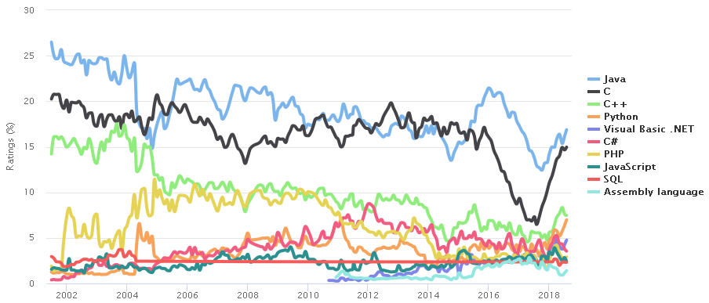

<p><strong>C</strong>&nbsp;is a&nbsp;<a title="General-purpose language" href="https://en.wikipedia.org/wiki/General-purpose_language">general-purpose</a>,&nbsp;<a title="Procedural programming" href="https://en.wikipedia.org/wiki/Procedural_programming">procedural</a>&nbsp;computer&nbsp;<a title="Programming language" href="https://en.wikipedia.org/wiki/Programming_language">programming language</a>&nbsp;supporting&nbsp;<a title="Structured programming" href="https://en.wikipedia.org/wiki/Structured_programming">structured programming</a>,&nbsp;<a class="mw-redirect" title="" href="https://en.wikipedia.org/wiki/Lexical_variable_scope">lexical variable scope</a>, and&nbsp;<a title="Recursion (computer science)" href="https://en.wikipedia.org/wiki/Recursion_(computer_science)">recursion</a>, while a&nbsp;<a class="mw-redirect" title="Static type system" href="https://en.wikipedia.org/wiki/Static_type_system">static type system</a>&nbsp;prevents unintended operations. By design, C provides constructs that map efficiently to typical&nbsp;<a title="Machine code" href="https://en.wikipedia.org/wiki/Machine_code">machine instructions</a>&nbsp;and has found lasting use in applications previously coded in&nbsp;<a title="Assembly language" href="https://en.wikipedia.org/wiki/Assembly_language">assembly language</a>. Such applications include&nbsp;<a title="Operating system" href="https://en.wikipedia.org/wiki/Operating_system">operating systems</a>&nbsp;and various&nbsp;<a title="Application software" href="https://en.wikipedia.org/wiki/Application_software">application software</a>&nbsp;for computers, from&nbsp;<a title="Supercomputer" href="https://en.wikipedia.org/wiki/Supercomputer">supercomputers</a>&nbsp;to&nbsp;<a title="Embedded system" href="https://en.wikipedia.org/wiki/Embedded_system">embedded systems</a>.</p>
<p>C was originally developed at&nbsp;<a title="Bell Labs" href="https://en.wikipedia.org/wiki/Bell_Labs">Bell Labs</a>&nbsp;by&nbsp;<a title="Dennis Ritchie" href="https://en.wikipedia.org/wiki/Dennis_Ritchie">Dennis Ritchie</a>&nbsp;between 1972 and 1973 to make utilities running on&nbsp;<a title="Unix" href="https://en.wikipedia.org/wiki/Unix">Unix</a>. Later, it was applied to re-implementing the kernel of the Unix operating system.&nbsp;During the 1980s, C gradually gained popularity. It has become one of the&nbsp;<a title="Measuring programming language popularity" href="https://en.wikipedia.org/wiki/Measuring_programming_language_popularity">most widely used programming languages</a>,&nbsp;with C&nbsp;<a title="Compiler" href="https://en.wikipedia.org/wiki/Compiler">compilers</a>&nbsp;from various vendors available for the majority of existing&nbsp;<a title="Computer architecture" href="https://en.wikipedia.org/wiki/Computer_architecture">computer architectures</a>&nbsp;and operating systems. C has been standardized by the&nbsp;<a title="American National Standards Institute" href="https://en.wikipedia.org/wiki/American_National_Standards_Institute">ANSI</a>&nbsp;since 1989 (see&nbsp;<a title="ANSI C" href="https://en.wikipedia.org/wiki/ANSI_C">ANSI C</a>) and by the&nbsp;<a title="International Organization for Standardization" href="https://en.wikipedia.org/wiki/International_Organization_for_Standardization">International Organization for Standardization</a>.</p>
<p>C is an&nbsp;<a title="Imperative programming" href="https://en.wikipedia.org/wiki/Imperative_programming">imperative</a>&nbsp;<a title="Procedural programming" href="https://en.wikipedia.org/wiki/Procedural_programming">procedural</a>&nbsp;language. It was designed to be compiled using a relatively straightforward&nbsp;<a title="Compiler" href="https://en.wikipedia.org/wiki/Compiler">compiler</a>&nbsp;to provide&nbsp;<a title="Low-level programming language" href="https://en.wikipedia.org/wiki/Low-level_programming_language">low-level</a>&nbsp;access to&nbsp;<a title="Computer memory" href="https://en.wikipedia.org/wiki/Computer_memory">memory</a>&nbsp;and language constructs that map efficiently to&nbsp;<a title="Machine code" href="https://en.wikipedia.org/wiki/Machine_code">machine instructions</a>, all with minimal&nbsp;<a title="Runtime system" href="https://en.wikipedia.org/wiki/Runtime_system">runtime support</a>. Despite its low-level capabilities, the language was designed to encourage&nbsp;<a title="Cross-platform software" href="https://en.wikipedia.org/wiki/Cross-platform_software">cross-platform</a>&nbsp;programming. A&nbsp;<a title="Specification (technical standard)" href="https://en.wikipedia.org/wiki/Specification_(technical_standard)">standards</a>-compliant C program written with&nbsp;<a title="Porting" href="https://en.wikipedia.org/wiki/Porting">portability</a>&nbsp;in mind can be compiled for a wide variety of computer platforms and operating systems with few changes to its source code. The language is available on various platforms, from embedded&nbsp;<a title="Microcontroller" href="https://en.wikipedia.org/wiki/Microcontroller">microcontrollers</a>&nbsp;to&nbsp;<a title="Supercomputer" href="https://en.wikipedia.org/wiki/Supercomputer">supercomputers</a>.</p>
<p>&nbsp;</p>


<table class="infobox vevent">
<tbody>
<tr>
<th scope="row"><a title="Programming paradigm" href="https://en.wikipedia.org/wiki/Programming_paradigm">Paradigm</a></th>
<td><a title="Imperative programming" href="https://en.wikipedia.org/wiki/Imperative_programming">Imperative</a>&nbsp;(<a title="Procedural programming" href="https://en.wikipedia.org/wiki/Procedural_programming">procedural</a>),&nbsp;<a title="Structured programming" href="https://en.wikipedia.org/wiki/Structured_programming">structured</a></td>
</tr>
<tr>
<th scope="row"><a title="Software design" href="https://en.wikipedia.org/wiki/Software_design">Designed&nbsp;by</a></th>
<td><a title="Dennis Ritchie" href="https://en.wikipedia.org/wiki/Dennis_Ritchie">Dennis Ritchie</a></td>
</tr>
<tr>
<th scope="row"><a class="mw-redirect" title="Software developer" href="https://en.wikipedia.org/wiki/Software_developer">Developer</a></th>
<td class="organiser"><a title="Dennis Ritchie" href="https://en.wikipedia.org/wiki/Dennis_Ritchie">Dennis Ritchie</a>&nbsp;&amp;&nbsp;<a title="Bell Labs" href="https://en.wikipedia.org/wiki/Bell_Labs">Bell Labs</a>&nbsp;(creators); ANSI X3J11 (<a title="ANSI C" href="https://en.wikipedia.org/wiki/ANSI_C">ANSI C</a>);&nbsp;<span class="nowrap">ISO/IEC JTC1/SC22/WG14</span>&nbsp;(ISO C)</td>
</tr>
<tr>
<th scope="row">First&nbsp;appeared</th>
<td>1972<span class="noprint">; 48&nbsp;years ago</span></td>
</tr>
<tr>
<td colspan="2">&nbsp;</td>
</tr>
<tr>
<th scope="row"><a title="Software release life cycle" href="https://en.wikipedia.org/wiki/Software_release_life_cycle">Stable release</a></th>
<td>
<div><a title="C18 (C standard revision)" href="https://en.wikipedia.org/wiki/C18_(C_standard_revision)">C18</a>&nbsp;/ June&nbsp;2018<span class="noprint">; 1&nbsp;year ago</span></div>
</td>
</tr>
<tr>
<th scope="row"><a title="Type system" href="https://en.wikipedia.org/wiki/Type_system">Typing discipline</a></th>
<td><a title="Type system" href="https://en.wikipedia.org/wiki/Type_system">Static</a>,&nbsp;<a class="mw-redirect" title="Weak typing" href="https://en.wikipedia.org/wiki/Weak_typing">weak</a>,&nbsp;<a title="Manifest typing" href="https://en.wikipedia.org/wiki/Manifest_typing">manifest</a>,&nbsp;<a title="Nominal type system" href="https://en.wikipedia.org/wiki/Nominal_type_system">nominal</a></td>
</tr>
<tr>
<th scope="row"><a title="Operating system" href="https://en.wikipedia.org/wiki/Operating_system">OS</a></th>
<td><a class="mw-redirect" title="Cross-platform" href="https://en.wikipedia.org/wiki/Cross-platform">Cross-platform</a></td>
</tr>
<tr>
<th scope="row"><a title="Filename extension" href="https://en.wikipedia.org/wiki/Filename_extension">Filename extensions</a></th>
<td>.c, .h</td>
</tr>
<tr>
<th colspan="2">Major&nbsp;<a title="Programming language implementation" href="https://en.wikipedia.org/wiki/Programming_language_implementation">implementations</a></th>
</tr>
<tr>
<td colspan="2">K&amp;R,&nbsp;<a title="GNU Compiler Collection" href="https://en.wikipedia.org/wiki/GNU_Compiler_Collection">GCC</a>,&nbsp;<a title="Clang" href="https://en.wikipedia.org/wiki/Clang">Clang</a>,&nbsp;<span class="nowrap"><a title="Intel C++ Compiler" href="https://en.wikipedia.org/wiki/Intel_C%2B%2B_Compiler">Intel C</a>,</span>&nbsp;<a title="C++Builder" href="https://en.wikipedia.org/wiki/C%2B%2BBuilder">C++Builder</a>,&nbsp;<span class="nowrap"><a title="Microsoft Visual C++" href="https://en.wikipedia.org/wiki/Microsoft_Visual_C%2B%2B">Microsoft Visual C++</a></span>,&nbsp;<span class="nowrap"><a title="Watcom C/C++" href="https://en.wikipedia.org/wiki/Watcom_C/C%2B%2B">Watcom C</a></span></td>
</tr>
<tr>
<th colspan="2"><a title="Programming language" href="https://en.wikipedia.org/wiki/Programming_language#Dialects,_flavors_and_implementations">Dialects</a></th>
</tr>
<tr>
<td colspan="2"><a title="Cyclone (programming language)" href="https://en.wikipedia.org/wiki/Cyclone_(programming_language)">Cyclone</a>,&nbsp;<a title="Unified Parallel C" href="https://en.wikipedia.org/wiki/Unified_Parallel_C">Unified Parallel C</a>,&nbsp;<a title="Split-C" href="https://en.wikipedia.org/wiki/Split-C">Split-C</a>,&nbsp;<a title="Cilk" href="https://en.wikipedia.org/wiki/Cilk">Cilk</a>,&nbsp;<a title="C*" href="https://en.wikipedia.org/wiki/C*">C*</a></td>
</tr>
<tr>
<th colspan="2">Influenced by</th>
</tr>
<tr>
<td colspan="2"><a title="B (programming language)" href="https://en.wikipedia.org/wiki/B_(programming_language)">B</a>&nbsp;(<a title="BCPL" href="https://en.wikipedia.org/wiki/BCPL">BCPL</a>,&nbsp;<a title="CPL (programming language)" href="https://en.wikipedia.org/wiki/CPL_(programming_language)">CPL</a>),&nbsp;<a title="ALGOL 68" href="https://en.wikipedia.org/wiki/ALGOL_68">ALGOL 68</a>,<sup id="cite_ref-dottcl_3-0" class="reference"><a href="https://en.wikipedia.org/wiki/C_(programming_language)#cite_note-dottcl-3">[3]</a></sup>&nbsp;<a title="Assembly language" href="https://en.wikipedia.org/wiki/Assembly_language">Assembly</a>,&nbsp;<a title="PL/I" href="https://en.wikipedia.org/wiki/PL/I">PL/I</a>,&nbsp;<a class="mw-redirect" title="FORTRAN" href="https://en.wikipedia.org/wiki/FORTRAN">FORTRAN</a></td>
</tr>
<tr>
<th colspan="2">Influenced</th>
</tr>
<tr>
<td colspan="2"><a title="Category:C programming language family" href="https://en.wikipedia.org/wiki/Category:C_programming_language_family">Numerous</a>:&nbsp;<a title="AMPL" href="https://en.wikipedia.org/wiki/AMPL">AMPL</a>,&nbsp;<a title="AWK" href="https://en.wikipedia.org/wiki/AWK">AWK</a>,&nbsp;<a title="C shell" href="https://en.wikipedia.org/wiki/C_shell">csh</a>,&nbsp;<a title="C++" href="https://en.wikipedia.org/wiki/C%2B%2B">C++</a>,&nbsp;<a title="C--" href="https://en.wikipedia.org/wiki/C--">C--</a>,&nbsp;<a title="C Sharp (programming language)" href="https://en.wikipedia.org/wiki/C_Sharp_(programming_language)">C#</a>,&nbsp;<a title="Objective-C" href="https://en.wikipedia.org/wiki/Objective-C">Objective-C</a>,&nbsp;<a title="D (programming language)" href="https://en.wikipedia.org/wiki/D_(programming_language)">D</a>,&nbsp;<a title="Go (programming language)" href="https://en.wikipedia.org/wiki/Go_(programming_language)">Go</a>,&nbsp;<a title="Java (programming language)" href="https://en.wikipedia.org/wiki/Java_(programming_language)">Java</a>,&nbsp;<a title="JavaScript" href="https://en.wikipedia.org/wiki/JavaScript">JavaScript</a>,&nbsp;<a title="Julia (programming language)" href="https://en.wikipedia.org/wiki/Julia_(programming_language)">Julia</a>,&nbsp;<a title="Limbo (programming language)" href="https://en.wikipedia.org/wiki/Limbo_(programming_language)">Limbo</a>,&nbsp;<a title="LPC (programming language)" href="https://en.wikipedia.org/wiki/LPC_(programming_language)">LPC</a>,&nbsp;<a title="Perl" href="https://en.wikipedia.org/wiki/Perl">Perl</a>,&nbsp;<a title="PHP" href="https://en.wikipedia.org/wiki/PHP">PHP</a>,&nbsp;<a title="Pike (programming language)" href="https://en.wikipedia.org/wiki/Pike_(programming_language)">Pike</a>,&nbsp;<a title="Processing (programming language)" href="https://en.wikipedia.org/wiki/Processing_(programming_language)">Processing</a>,&nbsp;<a title="Python (programming language)" href="https://en.wikipedia.org/wiki/Python_(programming_language)">Python</a>, Ring,&nbsp;<a title="Rust (programming language)" href="https://en.wikipedia.org/wiki/Rust_(programming_language)">Rust</a>,&nbsp;<a title="Seed7" href="https://en.wikipedia.org/wiki/Seed7">Seed7</a>,&nbsp;<a title="Vala (programming language)" href="https://en.wikipedia.org/wiki/Vala_(programming_language)">Vala</a>,&nbsp;<a title="Verilog" href="https://en.wikipedia.org/wiki/Verilog">Verilog</a>&nbsp;(HDL),&nbsp;<a title="Nim (programming language)" href="https://en.wikipedia.org/wiki/Nim_(programming_language)">Nim</a></td>
</tr>
<tr>
<td class="hlist" colspan="2">
<p><a class="image" href="logo.png"></a>&nbsp;<a class="extiw" title="wikibooks:C Programming" href="https://en.wikibooks.org/wiki/C_Programming">C Programming</a>&nbsp;at Wikibooks</p>
</td>
</tr>
</tbody>
</table>
</br>

<div class="toctitle" dir="ltr" lang="en">
<h2>Contents</h2>
<label class="toctogglelabel" for="toctogglecheckbox"></label></div>
<ul>
<li class="toclevel-1 tocsection-1"><a href="#Overview"><span class="toctext">Overview</span></a>
<ul>
<li class="toclevel-2 tocsection-2"><a href="#Relations_to_other_languages"><span class="toctext">Relations to other languages</span></a></li>
</ul>
</li>
<li class="toclevel-1 tocsection-3"><a href="#History"><span class="toctext">History</span></a>
<ul>
<li class="toclevel-2 tocsection-4"><a href="#Early_developments"><span class="toctext">Early developments</span></a></li>
<li class="toclevel-2 tocsection-5"><a href="#K&amp;R_C"><span class="toctext">K&amp;R C</span></a></li>
<li class="toclevel-2 tocsection-6"><a href="#ANSI_C_and_ISO_C"><span class="toctext">ANSI C and ISO C</span></a></li>
<li class="toclevel-2 tocsection-7"><a href="#C99"><span class="toctext">C99</span></a></li>
<li class="toclevel-2 tocsection-8"><a href="#C11"><span class="toctext">C11</span></a></li>
<li class="toclevel-2 tocsection-9"><a href="#C18"><span class="toctext">C18</span></a></li>
<li class="toclevel-2 tocsection-10"><a href="#Embedded_C"><span class="toctext">Embedded C</span></a></li>
</ul>
</li>
<li class="toclevel-1 tocsection-11"><a href="#Syntax"><span class="toctext">Syntax</span></a>
<ul>
<li class="toclevel-2 tocsection-12"><a href="#Character_set"><span class="toctext">Character set</span></a></li>
<li class="toclevel-2 tocsection-13"><a href="#Reserved_words"><span class="toctext">Reserved words</span></a></li>
<li class="toclevel-2 tocsection-14"><a href="#Operators"><span class="toctext">Operators</span></a></li>
</ul>
</li>
<li class="toclevel-1 tocsection-15"><a href="#%22Hello,_world%22_example"><span class="toctext">"Hello, world" example</span></a></li>
<li class="toclevel-1 tocsection-16"><a href="#Data_types"><span class="toctext">Data types</span></a>
<ul>
<li class="toclevel-2 tocsection-17"><a href="#Pointers"><span class="toctext">Pointers</span></a></li>
<li class="toclevel-2 tocsection-18"><a href="#Arrays"><span class="toctext">Arrays</span></a></li>
<li class="toclevel-2 tocsection-19"><a href="#Array%E2%80%93pointer_interchangeability"><span class="toctext">Array&ndash;pointer interchangeability</span></a></li>
</ul>
</li>
<li class="toclevel-1 tocsection-20"><a href="#Memory_management"><span class="toctext">Memory management</span></a></li>
<li class="toclevel-1 tocsection-21"><a href="#Libraries"><span class="toctext">Libraries</span></a>
<ul>
<li class="toclevel-2 tocsection-22"><a href="#File_handling_and_streams"><span class="toctext">File handling and streams</span></a></li>
</ul>
</li>
<li class="toclevel-1 tocsection-23"><a href="#Language_tools"><span class="toctext">Language tools</span></a></li>
<li class="toclevel-1 tocsection-24"><a href="#Uses"><span class="toctext">Uses</span></a></li>
<li class="toclevel-1 tocsection-25"><a href="#Related_languages"><span class="toctext">Related languages</span></a></li>
 <li class="toclevel-1 tocsection-25"><a href="#Beginner C Exercises"><span class="toctext">Beginner C Exercises</span></a></li>   
  
</ul>


<p>&nbsp;</p>
<p>&nbsp;</p>


<h2><span id="Overview" class="mw-headline">Overview</span></h2>
<div class="thumb tright">
<div class="thumbinner"><a class="image" href="den.jpg"></a>
<div class="thumbcaption" style="text-align: center;">
<div class="magnify">&nbsp;</div>
<strong><a title="Dennis Ritchie" href="https://en.wikipedia.org/wiki/Dennis_Ritchie">Dennis Ritchie</a>&nbsp;(right), the inventor of the C programming language, with&nbsp;<a title="Ken Thompson" href="https://en.wikipedia.org/wiki/Ken_Thompson">Ken Thompson</a></strong></div>
<div class="thumbcaption">&nbsp;</div>
<div class="thumbcaption">&nbsp;</div>
</div>
</div>


</br>
<h2>Publications </h2>
<ul>
 <li><a target="_blank" href="https://github.com/manjunath5496/C-Tutorial/blob/master/ck(1).pdf" style="text-decoration:none;">The UNIX Time Sharing System</a></li>
                            
 <li><a target="_blank" href="https://github.com/manjunath5496/C-Tutorial/blob/master/ck(2).pdf" style="text-decoration:none;">Recent Changes to C</a></li>

<li><a target="_blank" href="https://github.com/manjunath5496/C-Tutorial/blob/master/ck(3).pdf" style="text-decoration:none;">The Development of the C Language</a></li>
 <li><a target="_blank" href="https://github.com/manjunath5496/C-Tutorial/blob/master/ck(4).pdf" style="text-decoration:none;">Computing Science Technical Report No. 102: The C Language Calling Sequence</a></li>                              
<li><a target="_blank" href="https://github.com/manjunath5496/C-Tutorial/blob/master/ck(5).pdf" style="text-decoration:none;">C
Reference Manual</a></li>
<li><a target="_blank" href="https://github.com/manjunath5496/C-Tutorial/blob/master/ck(6).pdf" style="text-decoration:none;">Letter from Washington: The National Medal of Technology Experience</a></li>
 <li><a target="_blank" href="https://github.com/manjunath5496/C-Tutorial/blob/master/ck(7).pdf" style="text-decoration:none;">Programming in C &minus; A Tutorial</a></li>                              
<li><a target="_blank" href="https://github.com/manjunath5496/C-Tutorial/blob/master/ck(8).pdf" style="text-decoration:none;">The Evolution of the Unix Time-sharing System </a></li>

<li><a target="_blank" href="https://github.com/manjunath5496/C-Tutorial/blob/master/ck(9).pdf" style="text-decoration:none;">Interprocess Communication in the Ninth Edition Unix System</a></li>
 <li><a target="_blank" href="https://github.com/manjunath5496/C-Tutorial/blob/master/ck(10).pdf" style="text-decoration:none;">A Stream Input Output System</a></li>                              
<li><a target="_blank" href="https://github.com/manjunath5496/C-Tutorial/blob/master/ck(11).pdf" style="text-decoration:none;">Variable Size Arrays in C </a></li>


<li><a target="_blank" href="https://github.com/manjunath5496/C-Tutorial/blob/master/ck(12).pdf" style="text-decoration:none;">Odd Comments and Strange Doings in Unix</a></li>
 <li><a target="_blank" href="https://github.com/manjunath5496/C-Tutorial/blob/master/ck(13).pdf" style="text-decoration:none;">Five Little Languages and How They Grew: Talk at HOPL</a></li>                              
<li><a target="_blank" href="https://github.com/manjunath5496/C-Tutorial/blob/master/ck(14).pdf" style="text-decoration:none;">KEN, UNIX, AND GAMES </a></li>


<li><a target="_blank" href="https://github.com/manjunath5496/C-Tutorial/blob/master/ck(15).pdf" style="text-decoration:none;">Unix Portability</a></li>
 <li><a target="_blank" href="https://github.com/manjunath5496/C-Tutorial/blob/master/ck(16).pdf" style="text-decoration:none;">Writings from the Past</a></li>                              
<li><a target="_blank" href="https://github.com/manjunath5496/C-Tutorial/blob/master/ck(17).pdf" style="text-decoration:none;">An Early Retrospective </a></li>


<li><a target="_blank" href="https://github.com/manjunath5496/C-Tutorial/blob/master/ck(18).pdf" style="text-decoration:none;">A Stream Input Output System</a></li>
 <li><a target="_blank" href="https://github.com/manjunath5496/C-Tutorial/blob/master/ck(19).pdf" style="text-decoration:none;">Users' Reference to B</a></li>                              
<li><a target="_blank" href="https://github.com/manjunath5496/C-Tutorial/blob/master/ck(20).pdf" style="text-decoration:none;">THE PROGRAMMING LANGUAGE B </a></li>

<li><a target="_blank" href="https://github.com/manjunath5496/C-Tutorial/blob/master/ck(21).pdf" style="text-decoration:none;">Dabbling in the Cryptographic World - A Story </a></li>

<li><a target="_blank" href="https://github.com/manjunath5496/C-Tutorial/blob/master/ck(22).pdf" style="text-decoration:none;">Space Travel: Exploring the solar system and the PDP-7</a></li>

 <li><a target="_blank" href="https://github.com/manjunath5496/C-Tutorial/blob/master/ck(23).pdf" style="text-decoration:none;">The Inferno Operating System</a></li>                              
<li><a target="_blank" href="https://github.com/manjunath5496/C-Tutorial/blob/master/ck(24).pdf" style="text-decoration:none;">Advanced Programming in the UNIX Environment </a></li>

<li><a target="_blank" href="https://github.com/manjunath5496/C-Tutorial/blob/master/ck(25).pdf" style="text-decoration:none;">The complexity of loop programs </a></li>

<li><a target="_blank" href="https://github.com/manjunath5496/C-Tutorial/blob/master/ck(26).pdf" style="text- decoration:none;">Portability of C Programs and the UNIX System</a></li>
<li><a target="_blank" href="https://github.com/manjunath5496/C-Tutorial/blob/master/ck(27).pdf" style="text-decoration:none;">Unix Programmer's Manual </a></li>


<li><a target="_blank" href="https://github.com/manjunath5496/C-Tutorial/blob/master/ck(28).pdf" style="text-decoration:none;">Password Security: A Case History</a></li>

<li><a target="_blank" href="https://github.com/manjunath5496/C-Tutorial/blob/master/ck(29).pdf" style="text-decoration:none;">Parallel genetic evolution and speciation from standing variation</a></li>

<li><a target="_blank" href="https://github.com/manjunath5496/C-Tutorial/blob/master/ck(30).pdf" style="text-decoration:none;">Unix and
Beyond: An Interview with Ken Thompson</a></li>

 <li><a target="_blank" href="https://github.com/manjunath5496/C-Tutorial/blob/master/ck(31).pdf" style="text-decoration:none;">A New C Compiler</a></li>                              
<li><a target="_blank" href="https://github.com/manjunath5496/C-Tutorial/blob/master/ck(32).pdf" style="text-decoration:none;">Reflections on Trusting Trust </a></li>

<li><a target="_blank" href="https://github.com/manjunath5496/C-Tutorial/blob/master/ck(33).pdf" style="text-decoration:none;">UNIX Implementation </a></li>

<li><a target="_blank" href="https://github.com/manjunath5496/C-Tutorial/blob/master/ck(34).pdf" style="text- decoration:none;">Hello World</a></li>
<li><a target="_blank" href="https://github.com/manjunath5496/C-Tutorial/blob/master/ck(35).pdf" style="text-decoration:none;">Regular Expression Search Algorithm</a></li>

<li><a target="_blank" href="https://github.com/manjunath5496/C-Tutorial/blob/master/ck(36).pdf" style="text-decoration:none;">Programming languages - C - Extensions to support embedded processors </a></li>

<li><a target="_blank" href="https://github.com/manjunath5496/C-Tutorial/blob/master/ck(37).pdf" style="text- decoration:none;">Sibling Rivalry: C and C++</a></li>
<li><a target="_blank" href="https://github.com/manjunath5496/C-Tutorial/blob/master/ck(38).pdf" style="text-decoration:none;">A Research UNIX Reader: Annotated Excerpts from the Programmer's Manual, 1971-1986</a></li>

<li><a target="_blank" href="https://github.com/manjunath5496/C-Tutorial/blob/master/ck(39).pdf" style="text-decoration:none;">Programming languages — C</a></li>

<li><a target="_blank" href="https://github.com/manjunath5496/C-Tutorial/blob/master/ck(40).pdf" style="text-decoration:none;">Interview with Dennis Ritchie</a></li>


</ul>
</br>


<p>Like most procedural languages in the&nbsp;<a title="ALGOL" href="https://en.wikipedia.org/wiki/ALGOL">ALGOL</a>&nbsp;tradition, C has facilities for&nbsp;<a title="Structured programming" href="https://en.wikipedia.org/wiki/Structured_programming">structured programming</a>&nbsp;and allows&nbsp;<a class="mw-redirect" title="Lexical variable scope" href="https://en.wikipedia.org/wiki/Lexical_variable_scope">lexical variable scope</a>&nbsp;and recursion. Its static&nbsp;<a title="Type system" href="https://en.wikipedia.org/wiki/Type_system">type system</a>&nbsp;prevents unintended operations. In C, all&nbsp;<a class="mw-redirect" title="Executable code" href="https://en.wikipedia.org/wiki/Executable_code">executable code</a>&nbsp;is contained within&nbsp;<a title="Subroutine" href="https://en.wikipedia.org/wiki/Subroutine">subroutines</a>&nbsp;(also called "functions", though not strictly in the sense of&nbsp;<a title="Functional programming" href="https://en.wikipedia.org/wiki/Functional_programming">functional programming</a>).&nbsp;<a title="Parameter (computer programming)" href="https://en.wikipedia.org/wiki/Parameter_(computer_programming)">Function parameters</a>&nbsp;are always passed by value. Pass-by-reference is simulated in C by explicitly passing&nbsp;<a title="Pointer (computer programming)" href="https://en.wikipedia.org/wiki/Pointer_(computer_programming)">pointer</a>&nbsp;values. C program source text is&nbsp;<a title="Free-form language" href="https://en.wikipedia.org/wiki/Free-form_language">free-format</a>, using the&nbsp;<a title="Semicolon" href="https://en.wikipedia.org/wiki/Semicolon">semicolon</a>&nbsp;as a&nbsp;<a class="mw-redirect" title="Statement (programming)" href="https://en.wikipedia.org/wiki/Statement_(programming)">statement</a>&nbsp;terminator and&nbsp;<a class="mw-redirect" title="Curly braces" href="https://en.wikipedia.org/wiki/Curly_braces">curly braces</a>&nbsp;for grouping&nbsp;<a class="mw-redirect" title="Blocks of statements" href="https://en.wikipedia.org/wiki/Blocks_of_statements">blocks of statements</a>.</p>
<p>The C language also exhibits the following characteristics:</p>
<ul>
<li>The language has a small, fixed number of keywords, including a full set of&nbsp;<a title="Control flow" href="https://en.wikipedia.org/wiki/Control_flow">control flow</a>&nbsp;primitives:&nbsp;<code><a title="Conditional (computer programming)" href="https://en.wikipedia.org/wiki/Conditional_(computer_programming)">if/else</a></code>,&nbsp;<code><a title="For loop" href="https://en.wikipedia.org/wiki/For_loop">for</a></code>,&nbsp;<code><a title="Do while loop" href="https://en.wikipedia.org/wiki/Do_while_loop">do/while</a></code>,&nbsp;<code><a title="While loop" href="https://en.wikipedia.org/wiki/While_loop">while</a></code>, and&nbsp;<code><a title="Switch statement" href="https://en.wikipedia.org/wiki/Switch_statement">switch</a></code>. User-defined names are not distinguished from keywords by any kind of&nbsp;<a title="Sigil (computer programming)" href="https://en.wikipedia.org/wiki/Sigil_(computer_programming)">sigil</a>.</li>
<li>It has a large number of arithmetic, bitwise, and logic operators:&nbsp;<code>+</code>,&nbsp;<code>+=</code>,&nbsp;<code>++</code>,&nbsp;<code>&amp;</code>,&nbsp;<code>||</code>, etc.</li>
<li>More than one&nbsp;<a title="Assignment (computer science)" href="https://en.wikipedia.org/wiki/Assignment_(computer_science)">assignment</a>&nbsp;may be performed in a single statement.</li>
<li>Functions:
<ul>
<li>Function return values can be ignored, when not needed.</li>
<li>Function and data pointers permit&nbsp;<em>ad hoc</em>&nbsp;<a class="mw-redirect" title="Run-time polymorphism" href="https://en.wikipedia.org/wiki/Run-time_polymorphism">run-time polymorphism</a>.</li>
<li>Functions may not be defined within the lexical scope of other functions.</li>
</ul>
</li>
<li>Data typing is&nbsp;<a class="mw-redirect" title="Static typing" href="https://en.wikipedia.org/wiki/Static_typing">static</a>, but&nbsp;<a title="Strong and weak typing" href="https://en.wikipedia.org/wiki/Strong_and_weak_typing">weakly enforced</a>; all data has a type, but&nbsp;<a class="mw-redirect" title="Implicit conversion" href="https://en.wikipedia.org/wiki/Implicit_conversion">implicit conversions</a>&nbsp;are possible.</li>
<li><a title="Declaration (computer programming)" href="https://en.wikipedia.org/wiki/Declaration_(computer_programming)">Declaration</a>&nbsp;<a title="C syntax" href="https://en.wikipedia.org/wiki/C_syntax">syntax</a>&nbsp;mimics usage context. C has no "define" keyword; instead, a statement beginning with the name of a type is taken as a declaration. There is no "function" keyword; instead, a function is indicated by the presence of a parenthesized argument list.</li>
<li>User-defined (<a title="Typedef" href="https://en.wikipedia.org/wiki/Typedef">typedef</a>) and compound types are possible.
<ul>
<li>Heterogeneous aggregate data types (<code><a title="Struct (C programming language)" href="https://en.wikipedia.org/wiki/Struct_(C_programming_language)">struct</a></code>) allow related data elements to be accessed and assigned as a unit.</li>
<li><a title="Union type" href="https://en.wikipedia.org/wiki/Union_type">Union</a>&nbsp;is a structure with overlapping members; only the last member stored is valid.</li>
<li><a title="Array data type" href="https://en.wikipedia.org/wiki/Array_data_type">Array</a>&nbsp;indexing is a secondary notation, defined in terms of pointer arithmetic. Unlike structs, arrays are not first-class objects: they cannot be assigned or compared using single built-in operators. There is no "array" keyword in use or definition; instead, square brackets indicate arrays syntactically, for example&nbsp;<code>month[11]</code>.</li>
<li><a title="Enumerated type" href="https://en.wikipedia.org/wiki/Enumerated_type">Enumerated types</a>&nbsp;are possible with the&nbsp;<code>enum</code>&nbsp;keyword. They are freely interconvertible with integers.</li>
<li><a title="String (computer science)" href="https://en.wikipedia.org/wiki/String_(computer_science)">Strings</a>&nbsp;are not a distinct data type, but are conventionally&nbsp;<a title="C string handling" href="https://en.wikipedia.org/wiki/C_string_handling">implemented</a>&nbsp;as&nbsp;<a title="Null-terminated string" href="https://en.wikipedia.org/wiki/Null-terminated_string">null-terminated</a>&nbsp;character arrays.</li>
</ul>
</li>
<li>Low-level access to&nbsp;<a title="Computer memory" href="https://en.wikipedia.org/wiki/Computer_memory">computer memory</a>&nbsp;is possible by converting machine addresses to typed&nbsp;<a title="Pointer (computer programming)" href="https://en.wikipedia.org/wiki/Pointer_(computer_programming)">pointers</a>.</li>
<li><a class="mw-redirect" title="Procedure (computer science)" href="https://en.wikipedia.org/wiki/Procedure_(computer_science)">Procedures</a>&nbsp;(subroutines not returning values) are a special case of function, with an untyped return type&nbsp;<code>void</code>.</li>
<li>A&nbsp;<a title="C preprocessor" href="https://en.wikipedia.org/wiki/C_preprocessor">preprocessor</a>&nbsp;performs&nbsp;<a title="Macro (computer science)" href="https://en.wikipedia.org/wiki/Macro_(computer_science)">macro</a>&nbsp;definition,&nbsp;<a title="Source code" href="https://en.wikipedia.org/wiki/Source_code">source code</a>&nbsp;file inclusion, and&nbsp;<a title="Conditional compilation" href="https://en.wikipedia.org/wiki/Conditional_compilation">conditional compilation</a>.</li>
<li>There is a basic form of&nbsp;<a title="Modular programming" href="https://en.wikipedia.org/wiki/Modular_programming">modularity</a>: files can be compiled separately and&nbsp;<a title="Linker (computing)" href="https://en.wikipedia.org/wiki/Linker_(computing)">linked</a>&nbsp;together, with control over which functions and data objects are visible to other files via&nbsp;<a title="Static (keyword)" href="https://en.wikipedia.org/wiki/Static_(keyword)"><code>static</code></a>&nbsp;and&nbsp;<code>extern</code>&nbsp;attributes.</li>
<li>Complex functionality such as&nbsp;<a title="Input/output" href="https://en.wikipedia.org/wiki/Input/output">I/O</a>,&nbsp;<a title="String (computer science)" href="https://en.wikipedia.org/wiki/String_(computer_science)">string</a>&nbsp;manipulation, and mathematical functions are consistently delegated to&nbsp;<a title="Library (computing)" href="https://en.wikipedia.org/wiki/Library_(computing)">library routines</a>.</li>
</ul>
<p>While C does not include certain features found in other languages (such as&nbsp;<a title="Object-oriented programming" href="https://en.wikipedia.org/wiki/Object-oriented_programming">object orientation</a>&nbsp;and&nbsp;<a title="Garbage collection (computer science)" href="https://en.wikipedia.org/wiki/Garbage_collection_(computer_science)">garbage collection</a>), these can be implemented or emulated, often through the use of external libraries (e.g., the&nbsp;<a title="GObject" href="https://en.wikipedia.org/wiki/GObject">GLib Object System</a>&nbsp;or the&nbsp;<a title="Boehm garbage collector" href="https://en.wikipedia.org/wiki/Boehm_garbage_collector">Boehm garbage collector</a>).</p>


<h3><span id="Relations_to_other_languages" class="mw-headline">Relations to other languages</span></h3>
<p>Many later languages have borrowed directly or indirectly from C, including&nbsp;<a title="C++" href="https://en.wikipedia.org/wiki/C%2B%2B">C++</a>,&nbsp;<a title="C Sharp (programming language)" href="https://en.wikipedia.org/wiki/C_Sharp_(programming_language)">C#</a>, Unix's&nbsp;<a title="C shell" href="https://en.wikipedia.org/wiki/C_shell">C shell</a>,&nbsp;<a title="D (programming language)" href="https://en.wikipedia.org/wiki/D_(programming_language)">D</a>,&nbsp;<a title="Go (programming language)" href="https://en.wikipedia.org/wiki/Go_(programming_language)">Go</a>,&nbsp;<a title="Java (programming language)" href="https://en.wikipedia.org/wiki/Java_(programming_language)">Java</a>,&nbsp;<a title="JavaScript" href="https://en.wikipedia.org/wiki/JavaScript">JavaScript</a>&nbsp;(including&nbsp;<a title="JavaScript" href="https://en.wikipedia.org/wiki/JavaScript#transpilers">transpilers</a>),&nbsp;<a title="Limbo (programming language)" href="https://en.wikipedia.org/wiki/Limbo_(programming_language)">Limbo</a>,&nbsp;<a title="LPC (programming language)" href="https://en.wikipedia.org/wiki/LPC_(programming_language)">LPC</a>,&nbsp;<a title="Objective-C" href="https://en.wikipedia.org/wiki/Objective-C">Objective-C</a>,&nbsp;<a title="Perl" href="https://en.wikipedia.org/wiki/Perl">Perl</a>,&nbsp;<a title="PHP" href="https://en.wikipedia.org/wiki/PHP">PHP</a>,&nbsp;<a title="Python (programming language)" href="https://en.wikipedia.org/wiki/Python_(programming_language)">Python</a>,&nbsp;<a title="Rust (programming language)" href="https://en.wikipedia.org/wiki/Rust_(programming_language)">Rust</a>,&nbsp;<a title="Swift (programming language)" href="https://en.wikipedia.org/wiki/Swift_(programming_language)">Swift</a>,&nbsp;<a title="Verilog" href="https://en.wikipedia.org/wiki/Verilog">Verilog</a>&nbsp;and&nbsp;<a title="SystemVerilog" href="https://en.wikipedia.org/wiki/SystemVerilog">SystemVerilog</a>&nbsp;(hardware description languages).&nbsp;These languages have drawn many of their&nbsp;<a class="mw-redirect" title="Control structures" href="https://en.wikipedia.org/wiki/Control_structures">control structures</a>&nbsp;and other basic features from C. Most of them (Python being a dramatic exception) also express highly similar&nbsp;<a title="Syntax (programming languages)" href="https://en.wikipedia.org/wiki/Syntax_(programming_languages)">syntax</a>&nbsp;to C, and they tend to combine the recognizable expression and statement&nbsp;<a title="C syntax" href="https://en.wikipedia.org/wiki/C_syntax">syntax of C</a>&nbsp;with underlying type systems, data models, and semantics that can be radically different.</p>


<h2><span id="History" class="mw-headline">History</span></h2>
<h3><span id="Early_developments" class="mw-headline">Early developments</span></h3>
<table class="wikitable floatright" style="width: 175px;"><caption>Timeline of language development</caption>
<tbody>
<tr>
<th style="width: 61px;">Year</th>
<th style="width: 100px;">C Standard</th>
</tr>
<tr>
<td style="width: 61px;">1972</td>
<td style="width: 100px;">Birth</td>
</tr>
<tr>
<td style="width: 61px;">1978</td>
<td style="width: 100px;">K&amp;R C</td>
</tr>
<tr>
<td style="width: 61px;">1989/1990</td>
<td style="width: 100px;">ANSI C and ISO C</td>
</tr>
<tr>
<td style="width: 61px;">1999</td>
<td style="width: 100px;">C99</td>
</tr>
<tr>
<td style="width: 61px;">2011</td>
<td style="width: 100px;">C11</td>
</tr>
<tr>
<td style="width: 61px;">2017/2018</td>
<td style="width: 100px;">C18</td>
</tr>
</tbody>
</table>
<p>The origin of C is closely tied to the development of the&nbsp;<a title="Unix" href="https://en.wikipedia.org/wiki/Unix">Unix</a>&nbsp;operating system, originally implemented in&nbsp;<a title="Assembly language" href="https://en.wikipedia.org/wiki/Assembly_language">assembly language</a>&nbsp;on a&nbsp;<a title="PDP-7" href="https://en.wikipedia.org/wiki/PDP-7">PDP-7</a>&nbsp;by Dennis Ritchie and Ken Thompson, incorporating several ideas from colleagues. Eventually, they decided to port the operating system to a&nbsp;<a title="PDP-11" href="https://en.wikipedia.org/wiki/PDP-11">PDP-11</a>. The original PDP-11 version of Unix was also developed in assembly language.</p>
<p>Thompson desired a programming language to make utilities for the new platform. At first, he tried to make a&nbsp;<a title="Fortran" href="https://en.wikipedia.org/wiki/Fortran">Fortran</a>&nbsp;compiler, but soon gave up the idea. Instead, he created a cut-down version of the recently developed&nbsp;<a title="BCPL" href="https://en.wikipedia.org/wiki/BCPL">BCPL</a>&nbsp;<a class="mw-redirect" title="Systems programming language" href="https://en.wikipedia.org/wiki/Systems_programming_language">systems programming language</a>. The official description of BCPL was not available at the time,&nbsp;and Thompson modified the syntax to be less wordy, producing the similar but somewhat simpler&nbsp;<a title="B (programming language)" href="https://en.wikipedia.org/wiki/B_(programming_language)">B</a>.&nbsp;However, few utilities were ultimately written in B because it was too slow, and B could not take advantage of PDP-11 features such as&nbsp;<a title="Byte" href="https://en.wikipedia.org/wiki/Byte">byte</a>&nbsp;addressability.</p>
<p>In 1972, Ritchie started to improve B, which resulted in creating a new language C.&nbsp;The C compiler and some utilities made with it were included in&nbsp;<a class="mw-redirect" title="Version 2 Unix" href="https://en.wikipedia.org/wiki/Version_2_Unix">Version 2 Unix</a>.</p>
<p>At&nbsp;<a class="mw-redirect" title="Version 4 Unix" href="https://en.wikipedia.org/wiki/Version_4_Unix">Version 4 Unix</a>, released in November 1973, the&nbsp;<a title="Unix" href="https://en.wikipedia.org/wiki/Unix">Unix</a>&nbsp;<a title="Kernel (operating system)" href="https://en.wikipedia.org/wiki/Kernel_(operating_system)">kernel</a>&nbsp;was extensively re-implemented in C.&nbsp;By this time, the C language had acquired some powerful features such as&nbsp;<code>struct</code>&nbsp;types.</p>
<p>Unix was one of the first operating system kernels implemented in a language other than&nbsp;<a title="Assembly language" href="https://en.wikipedia.org/wiki/Assembly_language">assembly</a>. Earlier instances include the&nbsp;<a title="Multics" href="https://en.wikipedia.org/wiki/Multics">Multics</a>&nbsp;system (which was written in&nbsp;<a title="PL/I" href="https://en.wikipedia.org/wiki/PL/I">PL/I</a>) and&nbsp;<a title="Burroughs MCP" href="https://en.wikipedia.org/wiki/Burroughs_MCP">Master Control Program</a>&nbsp;(MCP) for the&nbsp;<a title="Burroughs large systems" href="https://en.wikipedia.org/wiki/Burroughs_large_systems">Burroughs B5000</a>&nbsp;(which was written in&nbsp;<a title="ALGOL" href="https://en.wikipedia.org/wiki/ALGOL">ALGOL</a>) in 1961. In around 1977, Ritchie and&nbsp;<a title="Stephen C. Johnson" href="https://en.wikipedia.org/wiki/Stephen_C._Johnson">Stephen C. Johnson</a>&nbsp;made further changes to the language to facilitate portability of the Unix operating system. Johnson's&nbsp;<a title="Portable C Compiler" href="https://en.wikipedia.org/wiki/Portable_C_Compiler">Portable C Compiler</a>&nbsp;served as the basis for several implementations of C on new platforms.</p>


<h3><span id="K&amp;R_C" class="mw-headline">K&amp;R C</span></h3>
<div class="thumb tright">&nbsp;</div>
<p>In 1978,&nbsp;<a title="Brian Kernighan" href="https://en.wikipedia.org/wiki/Brian_Kernighan">Brian Kernighan</a>&nbsp;and&nbsp;<a title="Dennis Ritchie" href="https://en.wikipedia.org/wiki/Dennis_Ritchie">Dennis Ritchie</a>&nbsp;published the first edition of&nbsp;<em><a title="The C Programming Language" href="https://en.wikipedia.org/wiki/The_C_Programming_Language">The C Programming Language</a></em>.&nbsp;This book, known to C programmers as&nbsp;<em>K&amp;R</em>, served for many years as an informal&nbsp;<a title="Specification (technical standard)" href="https://en.wikipedia.org/wiki/Specification_(technical_standard)">specification</a>&nbsp;of the language. The version of C that it describes is commonly referred to as "K&amp;R C". The second edition of the book&nbsp;covers the later&nbsp;<a title="ANSI C" href="https://en.wikipedia.org/wiki/ANSI_C">ANSI C</a>&nbsp;standard, described below.</p>
<p><em>K&amp;R</em>&nbsp;introduced several language features:</p>
<ul>
<li>Standard I/O library</li>
<li><code>long int</code>&nbsp;data type</li>
<li><code>unsigned int</code>&nbsp;data type</li>
<li>Compound assignment operators of the form&nbsp;<code>=<em>op</em></code>&nbsp;(such as&nbsp;<code>=-</code>) were changed to the form&nbsp;<code><em>op</em>=</code>&nbsp;(that is,&nbsp;<code>-=</code>) to remove the semantic ambiguity created by constructs such as&nbsp;<code>i=-10</code>, which had been interpreted as&nbsp;<code>i&nbsp;=-&nbsp;10</code>&nbsp;(decrement&nbsp;<code>i</code>&nbsp;by 10) instead of the possibly intended&nbsp;<code>i&nbsp;=&nbsp;-10</code>&nbsp;(let&nbsp;<code>i</code>&nbsp;be -10).</li>
</ul>
<p>Even after the publication of the 1989 ANSI standard, for many years K&amp;R C was still considered the "<a class="mw-redirect" title="Lowest common denominator (computers)" href="https://en.wikipedia.org/wiki/Lowest_common_denominator_(computers)">lowest common denominator</a>" to which C programmers restricted themselves when maximum portability was desired, since many older compilers were still in use, and because carefully written K&amp;R C code can be legal Standard C as well.</p>
<p>In early versions of C, only functions that return types other than&nbsp;<code>int</code>&nbsp;must be declared if used before the function definition; functions used without prior declaration were presumed to return type&nbsp;<code>int</code>.</p>
<p>For example:</p>
<div class="mw-highlight mw-content-ltr" dir="ltr">
    
    
```C language
long some_function();
/* int */ other_function();

/* int */ calling_function()
{
    long test1;
    register /* int */ test2;

    test1 = some_function();
    if (test1 > 0)
          test2 = 0;
    else
          test2 = other_function();
    return test2;
}
```

</div>
<p>The&nbsp;<code>int</code>&nbsp;type specifiers which are commented out could be omitted in K&amp;R C, but are required in later standards.</p>
<p>Since K&amp;R function declarations did not include any information about function arguments, function parameter&nbsp;<a class="mw-redirect" title="Type checking" href="https://en.wikipedia.org/wiki/Type_checking">type checks</a>&nbsp;were not performed, although some compilers would issue a warning message if a local function was called with the wrong number of arguments, or if multiple calls to an external function used different numbers or types of arguments. Separate tools such as Unix's&nbsp;<a class="mw-redirect" title="Lint programming tool" href="https://en.wikipedia.org/wiki/Lint_programming_tool">lint</a>&nbsp;utility were developed that (among other things) could check for consistency of function use across multiple source files.</p>
<p>In the years following the publication of K&amp;R C, several features were added to the language, supported by compilers from AT&amp;T (in particular&nbsp;<a title="Portable C Compiler" href="https://en.wikipedia.org/wiki/Portable_C_Compiler">PCC</a>) and some other vendors. These included:</p>
<ul>
<li><code><a title="Void type" href="https://en.wikipedia.org/wiki/Void_type">void</a></code>&nbsp;functions (i.e., functions with no return value)</li>
<li>functions returning&nbsp;<code><a title="Struct (C programming language)" href="https://en.wikipedia.org/wiki/Struct_(C_programming_language)">struct</a></code>&nbsp;or&nbsp;<code><a class="mw-redirect" title="Union (computer science)" href="https://en.wikipedia.org/wiki/Union_(computer_science)">union</a></code>&nbsp;types (rather than pointers)</li>
<li><a title="Assignment (computer science)" href="https://en.wikipedia.org/wiki/Assignment_(computer_science)">assignment</a>&nbsp;for&nbsp;<code>struct</code>&nbsp;data types</li>
<li><a title="Enumerated type" href="https://en.wikipedia.org/wiki/Enumerated_type">enumerated types</a></li>
</ul>
<p>The large number of extensions and lack of agreement on a&nbsp;<a title="C standard library" href="https://en.wikipedia.org/wiki/C_standard_library">standard library</a>, together with the language popularity and the fact that not even the Unix compilers precisely implemented the K&amp;R specification, led to the necessity of standardization.</p>


<h3><span id="ANSI_C_and_ISO_C" class="mw-headline">ANSI C and ISO C</span></h3>
<p>During the late 1970s and 1980s, versions of C were implemented for a wide variety of&nbsp;<a title="Mainframe computer" href="https://en.wikipedia.org/wiki/Mainframe_computer">mainframe computers</a>,&nbsp;<a title="Minicomputer" href="https://en.wikipedia.org/wiki/Minicomputer">minicomputers</a>, and&nbsp;<a title="Microcomputer" href="https://en.wikipedia.org/wiki/Microcomputer">microcomputers</a>, including the&nbsp;<a class="mw-redirect" title="IBM PC" href="https://en.wikipedia.org/wiki/IBM_PC">IBM PC</a>, as its popularity began to increase significantly.</p>
<p>In 1983, the&nbsp;<a title="American National Standards Institute" href="https://en.wikipedia.org/wiki/American_National_Standards_Institute">American National Standards Institute</a>&nbsp;(ANSI) formed a committee, X3J11, to establish a standard specification of C. X3J11 based the C standard on the Unix implementation; however, the non-portable portion of the Unix C library was handed off to the&nbsp;<a title="Institute of Electrical and Electronics Engineers" href="https://en.wikipedia.org/wiki/Institute_of_Electrical_and_Electronics_Engineers">IEEE</a>&nbsp;<a title="Working group" href="https://en.wikipedia.org/wiki/Working_group">working group</a>&nbsp;1003 to become the basis for the 1988&nbsp;<a title="POSIX" href="https://en.wikipedia.org/wiki/POSIX">POSIX</a>&nbsp;standard. In 1989, the C standard was ratified as ANSI X3.159-1989 "Programming Language C". This version of the language is often referred to as&nbsp;<a title="ANSI C" href="https://en.wikipedia.org/wiki/ANSI_C">ANSI C</a>, Standard C, or sometimes C89.</p>
<p>In 1990, the ANSI C standard (with formatting changes) was adopted by the&nbsp;<a title="International Organization for Standardization" href="https://en.wikipedia.org/wiki/International_Organization_for_Standardization">International Organization for Standardization</a>&nbsp;(ISO) as ISO/IEC 9899:1990, which is sometimes called C90. Therefore, the terms "C89" and "C90" refer to the same programming language.</p>
<p>ANSI, like other national standards bodies, no longer develops the C standard independently, but defers to the international C standard, maintained by the working group&nbsp;<a class="mw-redirect" title="ISO/IEC JTC1/SC22" href="https://en.wikipedia.org/wiki/ISO/IEC_JTC1/SC22">ISO/IEC JTC1/SC22</a>/WG14. National adoption of an update to the international standard typically occurs within a year of ISO publication.</p>
<p>One of the aims of the C standardization process was to produce a&nbsp;<a class="mw-redirect" title="Superset" href="https://en.wikipedia.org/wiki/Superset">superset</a>&nbsp;of K&amp;R C, incorporating many of the subsequently introduced unofficial features. The standards committee also included several additional features such as&nbsp;<a title="Function prototype" href="https://en.wikipedia.org/wiki/Function_prototype">function prototypes</a>&nbsp;(borrowed from C++),&nbsp;<code>void</code>&nbsp;pointers, support for international&nbsp;<a title="Character encoding" href="https://en.wikipedia.org/wiki/Character_encoding">character sets</a>&nbsp;and&nbsp;<a title="Locale (computer software)" href="https://en.wikipedia.org/wiki/Locale_(computer_software)">locales</a>, and preprocessor enhancements. Although the&nbsp;<a title="C syntax" href="https://en.wikipedia.org/wiki/C_syntax">syntax</a>&nbsp;for parameter declarations was augmented to include the style used in C++, the K&amp;R interface continued to be permitted, for compatibility with existing source code.</p>
<p>C89 is supported by current C compilers, and most modern C code is based on it. Any program written only in Standard C and without any hardware-dependent assumptions will run correctly on any&nbsp;<a title="Computing platform" href="https://en.wikipedia.org/wiki/Computing_platform">platform</a>&nbsp;with a conforming C implementation, within its resource limits. Without such precautions, programs may compile only on a certain platform or with a particular compiler, due, for example, to the use of non-standard libraries, such as&nbsp;<a title="Graphical user interface" href="https://en.wikipedia.org/wiki/Graphical_user_interface">GUI</a>&nbsp;libraries, or to a reliance on compiler- or platform-specific attributes such as the exact size of data types and byte&nbsp;<a title="Endianness" href="https://en.wikipedia.org/wiki/Endianness">endianness</a>.</p>
<p>In cases where code must be compilable by either standard-conforming or K&amp;R C-based compilers, the&nbsp;<code>__STDC__</code>&nbsp;macro can be used to split the code into Standard and K&amp;R sections to prevent the use on a K&amp;R C-based compiler of features available only in Standard C.</p>
<p>After the ANSI/ISO standardization process, the C language specification remained relatively static for several years. In 1995, Normative Amendment 1 to the 1990 C standard (ISO/IEC 9899/AMD1:1995, known informally as C95) was published, to correct some details and to add more extensive support for international character sets.</p>
<h3><span id="C99" class="mw-headline">C99</span></h3>
<p>The C standard was further revised in the late 1990s, leading to the publication of ISO/IEC 9899:1999 in 1999, which is commonly referred to as "<a title="C99" href="https://en.wikipedia.org/wiki/C99">C99</a>". It has since been amended three times by Technical Corrigenda.</p>
<p>C99 introduced several new features, including&nbsp;<a title="Inline function" href="https://en.wikipedia.org/wiki/Inline_function">inline functions</a>, several new&nbsp;<a title="Data type" href="https://en.wikipedia.org/wiki/Data_type">data types</a>&nbsp;(including&nbsp;<code>long long int</code>&nbsp;and a&nbsp;<code>complex</code>&nbsp;type to represent&nbsp;<a title="Complex number" href="https://en.wikipedia.org/wiki/Complex_number">complex numbers</a>),&nbsp;<a title="Variable-length array" href="https://en.wikipedia.org/wiki/Variable-length_array">variable-length arrays</a>&nbsp;and&nbsp;<a title="Flexible array member" href="https://en.wikipedia.org/wiki/Flexible_array_member">flexible array members</a>, improved support for&nbsp;<a title="IEEE 754" href="https://en.wikipedia.org/wiki/IEEE_754">IEEE 754</a>&nbsp;floating point, support for&nbsp;<a title="Variadic macro" href="https://en.wikipedia.org/wiki/Variadic_macro">variadic macros</a>&nbsp;(macros of variable&nbsp;<a title="Arity" href="https://en.wikipedia.org/wiki/Arity">arity</a>), and support for one-line comments beginning with&nbsp;<code>//</code>, as in&nbsp;<a title="BCPL" href="https://en.wikipedia.org/wiki/BCPL">BCPL</a>&nbsp;or C++. Many of these had already been implemented as extensions in several C compilers.</p>
<p>C99 is for the most part backward compatible with C90, but is stricter in some ways; in particular, a declaration that lacks a type specifier no longer has&nbsp;<code>int</code>&nbsp;implicitly assumed. A standard macro&nbsp;<code>__STDC_VERSION__</code>&nbsp;is defined with value&nbsp;<code>199901L</code>&nbsp;to indicate that C99 support is available.&nbsp;<a title="GNU Compiler Collection" href="https://en.wikipedia.org/wiki/GNU_Compiler_Collection">GCC</a>,&nbsp;<a class="mw-redirect" title="Sun Studio (software)" href="https://en.wikipedia.org/wiki/Sun_Studio_(software)">Solaris Studio</a>, and other C compilers now support many or all of the new features of C99. The C compiler in&nbsp;<a title="Microsoft Visual C++" href="https://en.wikipedia.org/wiki/Microsoft_Visual_C%2B%2B">Microsoft Visual C++</a>, however, implements the C89 standard and those parts of C99 that are required for compatibility with&nbsp;<a title="C++11" href="https://en.wikipedia.org/wiki/C%2B%2B11">C++11</a>.</p>
<h3><span id="C11" class="mw-headline">C11</span></h3>
<p>In 2007, work began on another revision of the C standard, informally called "C1X" until its official publication on 2011-12-08. The C standards committee adopted guidelines to limit the adoption of new features that had not been tested by existing implementations.</p>
<p>The C11 standard adds numerous new features to C and the library, including type generic macros, anonymous structures, improved Unicode support, atomic operations, multi-threading, and bounds-checked functions. It also makes some portions of the existing C99 library optional, and improves compatibility with C++. The standard macro&nbsp;<code>__STDC_VERSION__</code>&nbsp;is defined as&nbsp;<code>201112L</code>&nbsp;to indicate that C11 support is available.</p>
<h3><span id="C18" class="mw-headline">C18</span></h3>
<p>Published in June 2018, C18 is the current standard for the C programming language. It introduces no new language features, only technical corrections and clarifications to defects in C11. The standard macro&nbsp;<code>__STDC_VERSION__</code>&nbsp;is defined as&nbsp;<code>201710L</code>.</p>
<h3><span id="Embedded_C" class="mw-headline">Embedded C</span></h3>
<p>Historically, embedded C programming requires nonstandard extensions to the C language in order to support exotic features such as fixed-point arithmetic, multiple distinct memory banks, and basic I/O operations.</p>
<p>In 2008, the C Standards Committee published a&nbsp;<a title="Technical report" href="https://en.wikipedia.org/wiki/Technical_report">technical report</a>&nbsp;extending the C language&nbsp;to address these issues by providing a common standard for all implementations to adhere to. It includes a number of features not available in normal C, such as&nbsp;<a title="Fixed-point arithmetic" href="https://en.wikipedia.org/wiki/Fixed-point_arithmetic">fixed-point arithmetic</a>, named address spaces, and basic I/O hardware addressing.</p>
<h2><span id="Syntax" class="mw-headline">Syntax</span></h2>
<p>C has a&nbsp;<a title="Formal grammar" href="https://en.wikipedia.org/wiki/Formal_grammar">formal grammar</a>&nbsp;specified by the C standard.&nbsp;Line endings are generally not significant in C; however, line boundaries do have significance during the preprocessing phase. Comments may appear either between the delimiters&nbsp;<code>/*</code>&nbsp;and&nbsp;<code>*/</code>, or (since C99) following&nbsp;<code>//</code>&nbsp;until the end of the line. Comments delimited by&nbsp;<code>/*</code>&nbsp;and&nbsp;<code>*/</code>&nbsp;do not nest, and these sequences of characters are not interpreted as comment delimiters if they appear inside&nbsp;<a title="String literal" href="https://en.wikipedia.org/wiki/String_literal">string</a>&nbsp;or character literals.</p>
<p>C source files contain declarations and function definitions. Function definitions, in turn, contain declarations and&nbsp;<a title="Statement (computer science)" href="https://en.wikipedia.org/wiki/Statement_(computer_science)">statements</a>. Declarations either define new types using keywords such as&nbsp;<code>struct</code>,&nbsp;<code>union</code>, and&nbsp;<code>enum</code>, or assign types to and perhaps reserve storage for new variables, usually by writing the type followed by the variable name. Keywords such as&nbsp;<code>char</code>&nbsp;and&nbsp;<code>int</code>&nbsp;specify built-in types. Sections of code are enclosed in braces (<code>{</code>&nbsp;and&nbsp;<code>}</code>, sometimes called "curly brackets") to limit the scope of declarations and to act as a single statement for control structures.</p>
<p>As an imperative language, C uses&nbsp;<em>statements</em>&nbsp;to specify actions. The most common statement is an&nbsp;<em>expression statement</em>, consisting of an expression to be evaluated, followed by a semicolon; as a&nbsp;<a title="Side effect (computer science)" href="https://en.wikipedia.org/wiki/Side_effect_(computer_science)">side effect</a>&nbsp;of the evaluation, functions may be&nbsp;<a class="mw-redirect" title="Procedure call" href="https://en.wikipedia.org/wiki/Procedure_call">called</a>&nbsp;and variables may be&nbsp;<a title="Assignment (computer science)" href="https://en.wikipedia.org/wiki/Assignment_(computer_science)">assigned</a>&nbsp;new values. To modify the normal sequential execution of statements, C provides several control-flow statements identified by reserved keywords.&nbsp;<a title="Structured programming" href="https://en.wikipedia.org/wiki/Structured_programming">Structured programming</a>&nbsp;is supported by&nbsp;<code>if</code>(-<code>else</code>) conditional execution and by&nbsp;<code>do</code>-<code>while</code>,&nbsp;<code>while</code>, and&nbsp;<code>for</code>&nbsp;iterative execution (looping). The&nbsp;<code>for</code>&nbsp;statement has separate initialization, testing, and reinitialization expressions, any or all of which can be omitted.&nbsp;<code>break</code>&nbsp;and&nbsp;<code>continue</code>&nbsp;can be used to leave the innermost enclosing loop statement or skip to its reinitialization. There is also a non-structured&nbsp;<code><a title="Goto" href="https://en.wikipedia.org/wiki/Goto">goto</a></code>&nbsp;statement which branches directly to the designated&nbsp;<a title="Label (computer science)" href="https://en.wikipedia.org/wiki/Label_(computer_science)">label</a>&nbsp;within the function.&nbsp;<code>switch</code>&nbsp;selects a&nbsp;<code>case</code>&nbsp;to be executed based on the value of an integer expression.</p>
<p>Expressions can use a variety of built-in operators and may contain function calls. The order in which arguments to functions and operands to most operators are evaluated is unspecified. The evaluations may even be interleaved. However, all side effects (including storage to variables) will occur before the next "<a title="Sequence point" href="https://en.wikipedia.org/wiki/Sequence_point">sequence point</a>"; sequence points include the end of each expression statement, and the entry to and return from each function call. Sequence points also occur during evaluation of expressions containing certain operators (<code>&amp;&amp;</code>,&nbsp;<code>||</code>,&nbsp;<code><a title="?:" href="https://en.wikipedia.org/wiki/%3F:">?:</a></code>&nbsp;and the&nbsp;<a title="Comma operator" href="https://en.wikipedia.org/wiki/Comma_operator">comma operator</a>). This permits a high degree of object code optimization by the compiler, but requires C programmers to take more care to obtain reliable results than is needed for other programming languages.</p>
<p>Kernighan and Ritchie say in the Introduction of&nbsp;<em>The C Programming Language</em>: "C, like any other language, has its blemishes. Some of the operators have the wrong precedence; some parts of the syntax could be better."&nbsp;The C standard did not attempt to correct many of these blemishes, because of the impact of such changes on already existing software.</p>
<h3><span id="Character_set" class="mw-headline">Character set</span></h3>
<p>The basic C source character set includes the following characters:</p>
<ul>
<li>Lowercase and uppercase letters of ISO Basic Latin Alphabet:&nbsp;<code>a</code>&ndash;<code>z</code>&nbsp;<code>A</code>&ndash;<code>Z</code></li>
<li>Decimal digits:&nbsp;<code>0</code>&ndash;<code>9</code></li>
<li>Graphic characters:&nbsp;<code>! " #&nbsp;% &amp; ' ( ) * + , - . /&nbsp;:&nbsp;; &lt; = &gt;&nbsp;? [ \ ] ^ _ { | } ~</code></li>
<li><a title="Whitespace character" href="https://en.wikipedia.org/wiki/Whitespace_character">Whitespace characters</a>:&nbsp;<em><a title="Space (punctuation)" href="https://en.wikipedia.org/wiki/Space_(punctuation)">space</a></em>,&nbsp;<em><a class="mw-redirect" title="Tab character" href="https://en.wikipedia.org/wiki/Tab_character">horizontal tab</a></em>,&nbsp;<em><a class="mw-redirect" title="Tab character" href="https://en.wikipedia.org/wiki/Tab_character">vertical tab</a></em>,&nbsp;<em><a title="Page break" href="https://en.wikipedia.org/wiki/Page_break">form feed</a></em>,&nbsp;<em><a title="Newline" href="https://en.wikipedia.org/wiki/Newline">newline</a></em></li>
</ul>
<p>Newline indicates the end of a text line; it need not correspond to an actual single character, although for convenience C treats it as one.</p>
<p>Additional multi-byte encoded characters may be used in string literals, but they are not entirely&nbsp;<a title="Software portability" href="https://en.wikipedia.org/wiki/Software_portability">portable</a>. The latest C standard (<a title="C11 (C standard revision)" href="https://en.wikipedia.org/wiki/C11_(C_standard_revision)">C11</a>) allows multi-national&nbsp;<a title="Unicode" href="https://en.wikipedia.org/wiki/Unicode">Unicode</a>&nbsp;characters to be embedded portably within C source text by using&nbsp;<code>\uXXXX</code>&nbsp;or&nbsp;<code>\UXXXXXXXX</code>&nbsp;encoding (where the&nbsp;<code>X</code>&nbsp;denotes a hexadecimal character), although this feature is not yet widely implemented.</p>
<p>The basic C execution character set contains the same characters, along with representations for&nbsp;<a title="Bell character" href="https://en.wikipedia.org/wiki/Bell_character">alert</a>,&nbsp;<a title="Backspace" href="https://en.wikipedia.org/wiki/Backspace">backspace</a>, and&nbsp;<a title="Carriage return" href="https://en.wikipedia.org/wiki/Carriage_return">carriage return</a>.&nbsp;<a class="mw-redirect" title="Run time (program lifecycle phase)" href="https://en.wikipedia.org/wiki/Run_time_(program_lifecycle_phase)">Run-time</a>&nbsp;support for extended character sets has increased with each revision of the C standard.</p>


<h3><span id="Reserved_words" class="mw-headline">Reserved words</span></h3>
<p>C89 has 32 reserved words, also known as keywords, which are the words that cannot be used for any purposes other than those for which they are predefined:</p>
<div>
<table class="multicol">
<tbody>
<tr>
<td>
<dl>
<dd><code>auto</code></dd>
<dd><code>break</code></dd>
<dd><code>case</code></dd>
<dd><code>char</code></dd>
<dd><code>const</code></dd>
<dd><code>continue</code></dd>
<dd><code>default</code></dd>
<dd><code>do</code></dd>
</dl>
<p>&nbsp;</p>
</td>
<td>
<dl>
<dd><code><a class="mw-redirect" title="Double precision" href="https://en.wikipedia.org/wiki/Double_precision">double</a></code></dd>
<dd><code>else</code></dd>
<dd><code><a title="Enumerated type" href="https://en.wikipedia.org/wiki/Enumerated_type">enum</a></code></dd>
<dd><code><a title="External variable" href="https://en.wikipedia.org/wiki/External_variable">extern</a></code></dd>
<dd><code><a class="mw-redirect" title="Floating point" href="https://en.wikipedia.org/wiki/Floating_point">float</a></code></dd>
<dd><code><a title="For loop" href="https://en.wikipedia.org/wiki/For_loop">for</a></code></dd>
<dd><code><a title="Goto" href="https://en.wikipedia.org/wiki/Goto">goto</a></code></dd>
<dd><code>if</code></dd>
</dl>
<p>&nbsp;</p>
</td>
<td>
<dl>
<dd><code>int</code></dd>
<dd><code><a class="mw-redirect" title="Long integer" href="https://en.wikipedia.org/wiki/Long_integer">long</a></code></dd>
<dd><code><a class="mw-redirect" title="Register (C programming language)" href="https://en.wikipedia.org/wiki/Register_(C_programming_language)">register</a></code></dd>
<dd><code>return</code></dd>
<dd><code><a class="mw-redirect" title="Short integer" href="https://en.wikipedia.org/wiki/Short_integer">short</a></code></dd>
<dd><code>signed</code></dd>
<dd><code><a title="Sizeof" href="https://en.wikipedia.org/wiki/Sizeof">sizeof</a></code></dd>
<dd><code><a title="Static (keyword)" href="https://en.wikipedia.org/wiki/Static_(keyword)">static</a></code></dd>
</dl>
<p>&nbsp;</p>
</td>
<td>
<dl>
<dd><code><a title="Struct (C programming language)" href="https://en.wikipedia.org/wiki/Struct_(C_programming_language)">struct</a></code></dd>
<dd><code><a title="Switch statement" href="https://en.wikipedia.org/wiki/Switch_statement">switch</a></code></dd>
<dd><code>typedef</code></dd>
<dd><code>union</code></dd>
<dd><code>unsigned</code></dd>
<dd><code><a title="Void type" href="https://en.wikipedia.org/wiki/Void_type">void</a></code></dd>
<dd><code><a class="mw-redirect" title="Volatile variable" href="https://en.wikipedia.org/wiki/Volatile_variable">volatile</a></code></dd>
<dd><code><a title="While loop" href="https://en.wikipedia.org/wiki/While_loop">while</a></code></dd>
</dl>
<p>&nbsp;</p>
</td>
</tr>
</tbody>
</table>
</div>
<p>C99 reserved five more words:</p>
<div>
<table class="multicol">
<tbody>
<tr>
<td>
<dl>
<dd><code>_Bool</code></dd>
<dd><code>_Complex</code></dd>
</dl>
<p>&nbsp;</p>
</td>
<td>
<dl>
<dd><code>_Imaginary</code></dd>
<dd><code><a title="Inline function" href="https://en.wikipedia.org/wiki/Inline_function">inline</a></code></dd>
</dl>
<p>&nbsp;</p>
</td>
<td>
<dl>
<dd><code><a title="Restrict" href="https://en.wikipedia.org/wiki/Restrict">restrict</a></code></dd>
</dl>
<p>&nbsp;</p>
</td>
</tr>
</tbody>
</table>
</div>
<p>C11 reserved seven more words:</p>
<div>
<table class="multicol">
<tbody>
<tr>
<td>
<dl>
<dd><code>_Alignas</code></dd>
<dd><code>_Alignof</code></dd>
</dl>
<p>&nbsp;</p>
</td>
<td>
<dl>
<dd><code>_Atomic</code></dd>
<dd><code>_Generic</code></dd>
</dl>
<p>&nbsp;</p>
</td>
<td>
<dl>
<dd><code>_Noreturn</code></dd>
<dd><code>_Static_assert</code></dd>
</dl>
<p>&nbsp;</p>
</td>
<td>
<dl>
<dd><code>_Thread_local</code></dd>
</dl>
<p>&nbsp;</p>
</td>
</tr>
</tbody>
</table>
</div>
<p>Most of the recently reserved words begin with an underscore followed by a capital letter, because identifiers of that form were previously reserved by the C standard for use only by implementations. Since existing program source code should not have been using these identifiers, it would not be affected when C implementations started supporting these extensions to the programming language. Some standard headers do define more convenient synonyms for underscored identifiers. The language previously included a reserved word called&nbsp;<code>entry</code>, but this was seldom implemented, and has now been removed as a reserved word.</p>
<h3><span id="Operators" class="mw-headline">Operators</span></h3>
<p>C supports a rich set of&nbsp;<a title="Operator (computer programming)" href="https://en.wikipedia.org/wiki/Operator_(computer_programming)">operators</a>, which are symbols used within an&nbsp;<a title="Expression (computer science)" href="https://en.wikipedia.org/wiki/Expression_(computer_science)">expression</a>&nbsp;to specify the manipulations to be performed while evaluating that expression. C has operators for:</p>
<ul>
<li><a title="Arithmetic" href="https://en.wikipedia.org/wiki/Arithmetic">arithmetic</a>:&nbsp;<a title="Addition" href="https://en.wikipedia.org/wiki/Addition"><code>+</code></a>,&nbsp;<a title="Subtraction" href="https://en.wikipedia.org/wiki/Subtraction"><code>-</code></a>,&nbsp;<a title="Multiplication" href="https://en.wikipedia.org/wiki/Multiplication"><code>*</code></a>,&nbsp;<a title="Division (mathematics)" href="https://en.wikipedia.org/wiki/Division_(mathematics)"><code>/</code></a>,&nbsp;<a title="Modulo operation" href="https://en.wikipedia.org/wiki/Modulo_operation"><code>%</code></a></li>
<li><a title="Assignment (computer science)" href="https://en.wikipedia.org/wiki/Assignment_(computer_science)">assignment</a>:&nbsp;<code>=</code></li>
<li><a title="Augmented assignment" href="https://en.wikipedia.org/wiki/Augmented_assignment">augmented assignment</a>:&nbsp;<code>+=</code>,&nbsp;<code>-=</code>,&nbsp;<code>*=</code>,&nbsp;<code>/=</code>,&nbsp;<code>%=</code>,&nbsp;<code>&amp;=</code>,&nbsp;<code>|=</code>,&nbsp;<code>^=</code>,&nbsp;<code>&lt;&lt;=</code>,&nbsp;<code>&gt;&gt;=</code></li>
<li><a title="Bitwise operation" href="https://en.wikipedia.org/wiki/Bitwise_operation">bitwise logic</a>:&nbsp;<code>~</code>,&nbsp;<code>&amp;</code>,&nbsp;<code>|</code>,&nbsp;<code>^</code></li>
<li><a class="mw-redirect" title="Bit shift" href="https://en.wikipedia.org/wiki/Bit_shift">bitwise shifts</a>:&nbsp;<code>&lt;&lt;</code>,&nbsp;<code>&gt;&gt;</code></li>
<li><a title="Boolean algebra" href="https://en.wikipedia.org/wiki/Boolean_algebra">boolean logic</a>:&nbsp;<code>!</code>,&nbsp;<code>&amp;&amp;</code>,&nbsp;<code>||</code></li>
<li><a title="?:" href="https://en.wikipedia.org/wiki/%3F:">conditional evaluation</a>:&nbsp;<a title="?:" href="https://en.wikipedia.org/wiki/%3F:"><code>? :</code></a></li>
<li>equality testing:&nbsp;<a title="Equality (mathematics)" href="https://en.wikipedia.org/wiki/Equality_(mathematics)"><code>==</code></a>,&nbsp;<a title="Inequality (mathematics)" href="https://en.wikipedia.org/wiki/Inequality_(mathematics)"><code>!=</code></a></li>
<li><a title="Subroutine" href="https://en.wikipedia.org/wiki/Subroutine">calling functions</a>:&nbsp;<code>( )</code></li>
<li><a title="Increment and decrement operators" href="https://en.wikipedia.org/wiki/Increment_and_decrement_operators">increment and decrement</a>:&nbsp;<code>++</code>,&nbsp;<code>--</code></li>
<li><a title="Record (computer science)" href="https://en.wikipedia.org/wiki/Record_(computer_science)">member selection</a>:&nbsp;<code>.</code>,&nbsp;<code>-&gt;</code></li>
<li>object size:&nbsp;<code><a title="Sizeof" href="https://en.wikipedia.org/wiki/Sizeof">sizeof</a></code></li>
<li><a title="Order theory" href="https://en.wikipedia.org/wiki/Order_theory">order relations</a>:&nbsp;<code>&lt;</code>,&nbsp;<code>&lt;=</code>,&nbsp;<code>&gt;</code>,&nbsp;<code>&gt;=</code></li>
<li><a title="Pointer (computer programming)" href="https://en.wikipedia.org/wiki/Pointer_(computer_programming)">reference and dereference</a>:&nbsp;<code>&amp;</code>,&nbsp;<code>*</code>,&nbsp;<code>[ ]</code></li>
<li>sequencing:&nbsp;<a title="Comma operator" href="https://en.wikipedia.org/wiki/Comma_operator"><code>,</code></a></li>
<li><a title="Order of operations" href="https://en.wikipedia.org/wiki/Order_of_operations#Mathematical_precedence">subexpression grouping</a>:&nbsp;<code>( )</code></li>
<li><a title="Type conversion" href="https://en.wikipedia.org/wiki/Type_conversion">type conversion</a>:&nbsp;<code>(<em>typename</em>)</code></li>
</ul>
<p>C uses the operator&nbsp;<code>=</code>&nbsp;(used in mathematics to express equality) to indicate assignment, following the precedent of&nbsp;<a title="Fortran" href="https://en.wikipedia.org/wiki/Fortran">Fortran</a>&nbsp;and&nbsp;<a title="PL/I" href="https://en.wikipedia.org/wiki/PL/I">PL/I</a>, but unlike&nbsp;<a title="ALGOL" href="https://en.wikipedia.org/wiki/ALGOL">ALGOL</a>&nbsp;and its derivatives. C uses the operator&nbsp;<code>==</code>&nbsp;to test for equality. The similarity between these two operators (assignment and equality) may result in the accidental use of one in place of the other, and in many cases, the mistake does not produce an error message (although some compilers produce warnings). For example, the conditional expression&nbsp;<code>if (a == b + 1)</code>&nbsp;might mistakenly be written as&nbsp;<code>if (a = b + 1)</code>, which will be evaluated as true if&nbsp;<code>a</code>&nbsp;is not zero after the assignment.</p>
<p>The C&nbsp;<a title="Order of operations" href="https://en.wikipedia.org/wiki/Order_of_operations">operator precedence</a>&nbsp;is not always intuitive. For example, the operator&nbsp;<code>==</code>&nbsp;binds more tightly than (is executed prior to) the operators&nbsp;<code>&amp;</code>&nbsp;(bitwise AND) and&nbsp;<code>|</code>&nbsp;(bitwise OR) in expressions such as&nbsp;<code>x &amp; 1 == 0</code>, which must be written as&nbsp;<code>(x &amp; 1) == 0</code>&nbsp;if that is the coder's intent.</p>
<h2><span id=".22Hello.2C_world.22_example"></span><span id="&quot;Hello,_world&quot;_example" class="mw-headline"><span id="HELLOWORLD"></span>"Hello, world" example</span></h2>
<p>The "<a title="&quot;Hello, World!&quot; program" href="https://en.wikipedia.org/wiki/%22Hello,_World!%22_program">hello, world</a>" example, which appeared in the first edition of&nbsp;<em><a title="The C Programming Language" href="https://en.wikipedia.org/wiki/The_C_Programming_Language">K&amp;R</a></em>, has become the model for an introductory program in most programming textbooks. The program prints "hello, world" to the&nbsp;<a class="mw-redirect" title="Standard output" href="https://en.wikipedia.org/wiki/Standard_output">standard output</a>, which is usually a terminal or screen display.</p>
<p>The original version was:</p>
<div class="mw-highlight mw-content-ltr" dir="ltr">
    
    
```C language
main()
{
    printf("hello, world\n");
}
```


</div>
<p>A standard-conforming "hello, world" program is:</p>
<div class="mw-highlight mw-content-ltr" dir="ltr">
    
```C language
#include <stdio.h>

int main(void)
{
    printf("hello, world\n");
}
```

</div>
<p>The first line of the program contains a&nbsp;<a title="Preprocessor" href="https://en.wikipedia.org/wiki/Preprocessor">preprocessing directive</a>, indicated by&nbsp;<code>#include</code>. This causes the compiler to replace that line with the entire text of the&nbsp;<code><a class="mw-redirect" title="Stdio.h" href="https://en.wikipedia.org/wiki/Stdio.h">stdio.h</a></code>&nbsp;standard header, which contains declarations for standard input and output functions such as&nbsp;<code>printf</code>&nbsp;and&nbsp;<code>scanf</code>. The angle brackets surrounding&nbsp;<code>stdio.h</code>&nbsp;indicate that&nbsp;<code>stdio.h</code>&nbsp;is located using a search strategy that prefers headers provided with the compiler to other headers having the same name, as opposed to double quotes which typically include local or project-specific header files.</p>
<p>The next line indicates that a function named&nbsp;<code>main</code>&nbsp;is being defined. The&nbsp;<code><a class="mw-redirect" title="Main function (programming)" href="https://en.wikipedia.org/wiki/Main_function_(programming)">main</a></code>&nbsp;function serves a special purpose in C programs; the run-time environment calls the&nbsp;<code>main</code>&nbsp;function to begin program execution. The type specifier&nbsp;<code>int</code>&nbsp;indicates that the value that is returned to the invoker (in this case the run-time environment) as a result of evaluating the&nbsp;<code>main</code>&nbsp;function, is an integer. The keyword&nbsp;<code>void</code>&nbsp;as a parameter list indicates that this function takes no arguments.</p>
<p>The opening curly brace indicates the beginning of the definition of the&nbsp;<code>main</code>&nbsp;function.</p>
<p>The next line&nbsp;<em>calls</em>&nbsp;(diverts execution to) a function named&nbsp;<code><a class="mw-redirect" title="Printf" href="https://en.wikipedia.org/wiki/Printf">printf</a></code>, which in this case is supplied from a system&nbsp;<a title="Library (computing)" href="https://en.wikipedia.org/wiki/Library_(computing)">library</a>. In this call, the&nbsp;<code>printf</code>&nbsp;function is&nbsp;<em>passed</em>&nbsp;(provided with) a single argument, the address of the first character in the&nbsp;<a title="String literal" href="https://en.wikipedia.org/wiki/String_literal">string literal</a>&nbsp;<code>"hello, world\n"</code>. The string literal is an unnamed&nbsp;<a title="Array data type" href="https://en.wikipedia.org/wiki/Array_data_type">array</a>&nbsp;with elements of type&nbsp;<code>char</code>, set up automatically by the compiler with a final 0-valued character to mark the end of the array (<code>printf</code>&nbsp;needs to know this). The&nbsp;<code>\n</code>&nbsp;is an&nbsp;<em><a title="Escape sequences in C" href="https://en.wikipedia.org/wiki/Escape_sequences_in_C">escape sequence</a></em>&nbsp;that C translates to a&nbsp;<em><a title="Newline" href="https://en.wikipedia.org/wiki/Newline">newline</a></em>&nbsp;character, which on output signifies the end of the current line. The return value of the&nbsp;<code>printf</code>&nbsp;function is of type&nbsp;<code>int</code>, but it is silently discarded since it is not used. (A more careful program might test the return value to determine whether or not the&nbsp;<code>printf</code>&nbsp;function succeeded.) The semicolon&nbsp;<code>;</code>&nbsp;terminates the statement.</p>
<p>The closing curly brace indicates the end of the code for the&nbsp;<code>main</code>&nbsp;function. According to the C99 specification and newer, the&nbsp;<code>main</code>&nbsp;function, unlike any other function, will implicitly return a value of&nbsp;<code>0</code>&nbsp;upon reaching the&nbsp;<code>}</code>&nbsp;that terminates the function. (Formerly an explicit&nbsp;<code>return 0;</code>&nbsp;statement was required.) This is interpreted by the run-time system as an exit code indicating successful execution.</p>


<h2><span id="Data_types" class="mw-headline">Data types</span></h2>
<div class="hatnote navigation-not-searchable">&nbsp;</div>
<p>The&nbsp;<a title="Type system" href="https://en.wikipedia.org/wiki/Type_system">type system</a>&nbsp;in C is&nbsp;<a class="mw-redirect" title="Static typing" href="https://en.wikipedia.org/wiki/Static_typing">static</a>&nbsp;and&nbsp;<a class="mw-redirect" title="Weak typing" href="https://en.wikipedia.org/wiki/Weak_typing">weakly typed</a>, which makes it similar to the type system of&nbsp;<a title="ALGOL" href="https://en.wikipedia.org/wiki/ALGOL">ALGOL</a>&nbsp;descendants such as&nbsp;<a title="Pascal (programming language)" href="https://en.wikipedia.org/wiki/Pascal_(programming_language)">Pascal</a>.&nbsp;There are built-in types for integers of various sizes, both signed and unsigned,&nbsp;<a class="mw-redirect" title="Floating-point number" href="https://en.wikipedia.org/wiki/Floating-point_number">floating-point numbers</a>, and enumerated types (<code>enum</code>). Integer type&nbsp;<code>char</code>&nbsp;is often used for single-byte characters. C99 added a&nbsp;<a class="mw-redirect" title="Boolean datatype" href="https://en.wikipedia.org/wiki/Boolean_datatype">boolean datatype</a>. There are also derived types including&nbsp;<a title="Array data type" href="https://en.wikipedia.org/wiki/Array_data_type">arrays</a>,&nbsp;<a title="Pointer (computer programming)" href="https://en.wikipedia.org/wiki/Pointer_(computer_programming)">pointers</a>,&nbsp;<a title="Record (computer science)" href="https://en.wikipedia.org/wiki/Record_(computer_science)">records</a>&nbsp;(<code><a title="Struct (C programming language)" href="https://en.wikipedia.org/wiki/Struct_(C_programming_language)">struct</a></code>), and&nbsp;<a class="mw-redirect" title="Union (computer science)" href="https://en.wikipedia.org/wiki/Union_(computer_science)">unions</a>&nbsp;(<code>union</code>).</p>
<p>C is often used in low-level systems programming where escapes from the type system may be necessary. The compiler attempts to ensure type correctness of most expressions, but the programmer can override the checks in various ways, either by using a&nbsp;<em><a title="Type conversion" href="https://en.wikipedia.org/wiki/Type_conversion">type cast</a></em>&nbsp;to explicitly convert a value from one type to another, or by using pointers or unions to reinterpret the underlying bits of a data object in some other way.</p>
<p>Some find C's declaration syntax unintuitive, particularly for&nbsp;<a title="Function pointer" href="https://en.wikipedia.org/wiki/Function_pointer">function pointers</a>. (Ritchie's idea was to declare identifiers in contexts resembling their use: "<a class="mw-redirect" title="Declaration reflects use" href="https://en.wikipedia.org/wiki/Declaration_reflects_use">declaration reflects use</a>".)</p>
<p>C's&nbsp;<em>usual arithmetic conversions</em>&nbsp;allow for efficient code to be generated, but can sometimes produce unexpected results. For example, a comparison of signed and unsigned integers of equal width requires a conversion of the signed value to unsigned. This can generate unexpected results if the signed value is negative.</p>
<h3><span id="Pointers" class="mw-headline">Pointers</span></h3>
<p>C supports the use of&nbsp;<a title="Pointer (computer programming)" href="https://en.wikipedia.org/wiki/Pointer_(computer_programming)">pointers</a>, a type of&nbsp;<a title="Reference (computer science)" href="https://en.wikipedia.org/wiki/Reference_(computer_science)">reference</a>&nbsp;that records the address or location of an object or function in memory. Pointers can be&nbsp;<em>dereferenced</em>&nbsp;to access data stored at the address pointed to, or to invoke a pointed-to function. Pointers can be manipulated using assignment or&nbsp;<a class="mw-redirect" title="Pointer arithmetic" href="https://en.wikipedia.org/wiki/Pointer_arithmetic">pointer arithmetic</a>. The run-time representation of a pointer value is typically a raw memory address (perhaps augmented by an offset-within-word field), but since a pointer's type includes the type of the thing pointed to, expressions including pointers can be type-checked at compile time. Pointer arithmetic is automatically scaled by the size of the pointed-to data type. Pointers are used for many purposes in C.&nbsp;<a title="String (computer science)" href="https://en.wikipedia.org/wiki/String_(computer_science)">Text strings</a>&nbsp;are commonly manipulated using pointers into arrays of characters.&nbsp;<a class="mw-redirect" title="Dynamic memory allocation" href="https://en.wikipedia.org/wiki/Dynamic_memory_allocation">Dynamic memory allocation</a>&nbsp;is performed using pointers. Many data types, such as&nbsp;<a title="Tree (data structure)" href="https://en.wikipedia.org/wiki/Tree_(data_structure)">trees</a>, are commonly implemented as dynamically allocated&nbsp;<code>struct</code>&nbsp;objects linked together using pointers. Pointers to functions are useful for passing functions as arguments to&nbsp;<a title="Higher-order function" href="https://en.wikipedia.org/wiki/Higher-order_function">higher-order functions</a>&nbsp;(such as&nbsp;<a title="Qsort" href="https://en.wikipedia.org/wiki/Qsort">qsort</a>&nbsp;or&nbsp;<a class="mw-redirect" title="Bsearch" href="https://en.wikipedia.org/wiki/Bsearch">bsearch</a>) or as&nbsp;<a class="mw-redirect" title="Callback (computer science)" href="https://en.wikipedia.org/wiki/Callback_(computer_science)">callbacks</a>&nbsp;to be invoked by event handlers.</p>
<p>A&nbsp;<em><a title="Null pointer" href="https://en.wikipedia.org/wiki/Null_pointer">null pointer</a>&nbsp;value</em>&nbsp;explicitly points to no valid location. Dereferencing a null pointer value is undefined, often resulting in a&nbsp;<a title="Segmentation fault" href="https://en.wikipedia.org/wiki/Segmentation_fault">segmentation fault</a>. Null pointer values are useful for indicating special cases such as no "next" pointer in the final node of a&nbsp;<a title="Linked list" href="https://en.wikipedia.org/wiki/Linked_list">linked list</a>, or as an error indication from functions returning pointers. In appropriate contexts in source code, such as for assigning to a pointer variable, a&nbsp;<em>null pointer constant</em>&nbsp;can be written as&nbsp;<code>0</code>, with or without explicit casting to a pointer type, or as the&nbsp;<code>NULL</code>&nbsp;macro defined by several standard headers. In conditional contexts, null pointer values evaluate to false, while all other pointer values evaluate to true.</p>
<p>Void pointers (<code>void *</code>) point to objects of unspecified type, and can therefore be used as "generic" data pointers. Since the size and type of the pointed-to object is not known, void pointers cannot be dereferenced, nor is pointer arithmetic on them allowed, although they can easily be (and in many contexts implicitly are) converted to and from any other object pointer type.</p>
<p>Careless use of pointers is potentially dangerous. Because they are typically unchecked, a pointer variable can be made to point to any arbitrary location, which can cause undesirable effects. Although properly used pointers point to safe places, they can be made to point to unsafe places by using invalid&nbsp;<a class="mw-redirect" title="Pointer arithmetic" href="https://en.wikipedia.org/wiki/Pointer_arithmetic">pointer arithmetic</a>; the objects they point to may continue to be used after deallocation (<a title="Dangling pointer" href="https://en.wikipedia.org/wiki/Dangling_pointer">dangling pointers</a>); they may be used without having been initialized (<a class="mw-redirect" title="Wild pointer" href="https://en.wikipedia.org/wiki/Wild_pointer">wild pointers</a>); or they may be directly assigned an unsafe value using a cast, union, or through another corrupt pointer. In general, C is permissive in allowing manipulation of and conversion between pointer types, although compilers typically provide options for various levels of checking. Some other programming languages address these problems by using more restrictive&nbsp;<a title="Reference (computer science)" href="https://en.wikipedia.org/wiki/Reference_(computer_science)">reference</a>&nbsp;types.</p>
<h3><span id="Arrays" class="mw-headline">Arrays</span></h3>
<p><a title="Array data type" href="https://en.wikipedia.org/wiki/Array_data_type">Array</a>&nbsp;types in C are traditionally of a fixed, static size specified at compile time. (The more recent C99 standard also allows a form of variable-length arrays.) However, it is also possible to allocate a block of memory (of arbitrary size) at run-time, using the standard library's&nbsp;<code>malloc</code>&nbsp;function, and treat it as an array. C's unification of arrays and pointers means that declared arrays and these dynamically allocated simulated arrays are virtually interchangeable.</p>
<p>Since arrays are always accessed (in effect) via pointers, array accesses are typically&nbsp;<em>not</em>&nbsp;checked against the underlying array size, although some compilers may provide&nbsp;<a title="Bounds checking" href="https://en.wikipedia.org/wiki/Bounds_checking">bounds checking</a>&nbsp;as an option.&nbsp;Array bounds violations are therefore possible and rather common in carelessly written code, and can lead to various repercussions, including illegal memory accesses, corruption of data,&nbsp;<a title="Buffer overflow" href="https://en.wikipedia.org/wiki/Buffer_overflow">buffer overruns</a>, and run-time exceptions. If bounds checking is desired, it must be done manually.</p>
<p>C does not have a special provision for declaring&nbsp;<a class="mw-redirect" title="Multi-dimensional array" href="https://en.wikipedia.org/wiki/Multi-dimensional_array">multi-dimensional arrays</a>, but rather relies on&nbsp;<a title="Recursion (computer science)" href="https://en.wikipedia.org/wiki/Recursion_(computer_science)">recursion</a>&nbsp;within the type system to declare arrays of arrays, which effectively accomplishes the same thing. The index values of the resulting "multi-dimensional array" can be thought of as increasing in&nbsp;<a class="mw-redirect" title="Row-major order" href="https://en.wikipedia.org/wiki/Row-major_order">row-major order</a>.</p>
<p>Multi-dimensional arrays are commonly used in numerical algorithms (mainly from applied&nbsp;<a title="Linear algebra" href="https://en.wikipedia.org/wiki/Linear_algebra">linear algebra</a>) to store matrices. The structure of the C array is well suited to this particular task. However, since arrays are passed merely as pointers, the bounds of the array must be known fixed values or else explicitly passed to any subroutine that requires them, and dynamically sized arrays of arrays cannot be accessed using double indexing. (A workaround for this is to allocate the array with an additional "row vector" of pointers to the columns.)</p>
<p>C99 introduced "variable-length arrays" which address some, but not all, of the issues with ordinary C arrays.</p>
<h3><span id="Array.E2.80.93pointer_interchangeability"></span><span id="Array&ndash;pointer_interchangeability" class="mw-headline">Array&ndash;pointer interchangeability</span></h3>
<p>The subscript notation&nbsp;<code>x[i]</code>&nbsp;(where&nbsp;<code>x</code>&nbsp;designates a pointer) is&nbsp;<a title="Syntactic sugar" href="https://en.wikipedia.org/wiki/Syntactic_sugar">syntactic sugar</a>&nbsp;for&nbsp;<code>*(x+i)</code>.&nbsp;Taking advantage of the compiler's knowledge of the pointer type, the address that&nbsp;<code>x + i</code>&nbsp;points to is not the base address (pointed to by&nbsp;<code>x</code>) incremented by&nbsp;<code>i</code>&nbsp;bytes, but rather is defined to be the base address incremented by&nbsp;<code>i</code>&nbsp;multiplied by the size of an element that&nbsp;<code>x</code>&nbsp;points to. Thus,&nbsp;<code>x[i]</code>&nbsp;designates the&nbsp;<code>i+1</code>th element of the array.</p>
<p>Furthermore, in most expression contexts (a notable exception is as operand of&nbsp;<code><a title="Sizeof" href="https://en.wikipedia.org/wiki/Sizeof">sizeof</a></code>), the name of an array is automatically converted to a pointer to the array's first element. This implies that an array is never copied as a whole when named as an argument to a function, but rather only the address of its first element is passed. Therefore, although function calls in C use&nbsp;<a class="mw-redirect" title="Call-by-value" href="https://en.wikipedia.org/wiki/Call-by-value">pass-by-value</a>&nbsp;semantics, arrays are in effect passed by&nbsp;<a title="Reference (computer science)" href="https://en.wikipedia.org/wiki/Reference_(computer_science)">reference</a>.</p>
<p>The size of an element can be determined by applying the operator&nbsp;<code>sizeof</code>&nbsp;to any dereferenced element of&nbsp;<code>x</code>, as in&nbsp;<code>n = sizeof *x</code>&nbsp;or&nbsp;<code>n = sizeof x[0]</code>, and the number of elements in a declared array&nbsp;<code>A</code>&nbsp;can be determined as&nbsp;<code>sizeof A / sizeof A[0]</code>. The latter only applies to array names: variables declared with subscripts (<code>int A[20]</code>). Due to the semantics of C, it is not possible to determine the entire size of arrays through pointers to arrays or those created by dynamic allocation (<code><a class="mw-redirect" title="Malloc" href="https://en.wikipedia.org/wiki/Malloc">malloc</a></code>); code such as&nbsp;<code>sizeof arr / sizeof arr[0]</code>&nbsp;(where&nbsp;<code>arr</code>&nbsp;designates a pointer) will not work since the compiler assumes the size of the pointer itself is being requested.&nbsp;Since array name arguments to&nbsp;<code>sizeof</code>&nbsp;are not converted to pointers, they do not exhibit such ambiguity. However, arrays created by dynamic allocation are accessed by pointers rather than true array variables, so they suffer from the same&nbsp;<code>sizeof</code>&nbsp;issues as array pointers.</p>
<p>Thus, despite this apparent equivalence between array and pointer variables, there is still a distinction to be made between them. Even though the name of an array is, in most expression contexts, converted into a pointer (to its first element), this pointer does not itself occupy any storage; the array name is not an&nbsp;<a title="Value (computer science)" href="https://en.wikipedia.org/wiki/Value_(computer_science)">l-value</a>, and its address is a constant, unlike a pointer variable. Consequently, what an array "points to" cannot be changed, and it is impossible to assign a new address to an array name. Array contents may be copied, however, by using the&nbsp;<code>memcpy</code>&nbsp;function, or by accessing the individual elements.</p>
<h2><span id="Memory_management" class="mw-headline">Memory management</span></h2>
<p>One of the most important functions of a programming language is to provide facilities for managing&nbsp;<a title="Computer memory" href="https://en.wikipedia.org/wiki/Computer_memory">memory</a>&nbsp;and the objects that are stored in memory. C provides three distinct ways to allocate memory for objects:</p>
<ul>
<li><a class="mw-redirect" title="Static memory allocation" href="https://en.wikipedia.org/wiki/Static_memory_allocation">Static memory allocation</a>: space for the object is provided in the binary at compile-time; these objects have an&nbsp;<a class="mw-redirect" title="Variable (programming)" href="https://en.wikipedia.org/wiki/Variable_(programming)#Scope_and_extent">extent</a>&nbsp;(or lifetime) as long as the binary which contains them is loaded into memory.</li>
<li><a class="mw-redirect" title="Automatic memory allocation" href="https://en.wikipedia.org/wiki/Automatic_memory_allocation">Automatic memory allocation</a>: temporary objects can be stored on the&nbsp;<a title="Call stack" href="https://en.wikipedia.org/wiki/Call_stack">stack</a>, and this space is automatically freed and reusable after the block in which they are declared is exited.</li>
<li><a class="mw-redirect" title="Dynamic memory allocation" href="https://en.wikipedia.org/wiki/Dynamic_memory_allocation">Dynamic memory allocation</a>: blocks of memory of arbitrary size can be requested at run-time using library functions such as&nbsp;<code><a class="mw-redirect" title="Malloc" href="https://en.wikipedia.org/wiki/Malloc">malloc</a></code>&nbsp;from a region of memory called the&nbsp;<a class="mw-redirect" title="Dynamic memory allocation" href="https://en.wikipedia.org/wiki/Dynamic_memory_allocation">heap</a>; these blocks persist until subsequently freed for reuse by calling the library function&nbsp;<code><a class="mw-redirect" title="Malloc" href="https://en.wikipedia.org/wiki/Malloc">realloc</a></code>&nbsp;or&nbsp;<code><a class="mw-redirect" title="Malloc" href="https://en.wikipedia.org/wiki/Malloc">free</a></code></li>
</ul>
<p>These three approaches are appropriate in different situations and have various trade-offs. For example, static memory allocation has little allocation overhead, automatic allocation may involve slightly more overhead, and dynamic memory allocation can potentially have a great deal of overhead for both allocation and deallocation. The persistent nature of static objects is useful for maintaining state information across function calls, automatic allocation is easy to use but stack space is typically much more limited and transient than either static memory or heap space, and dynamic memory allocation allows convenient allocation of objects whose size is known only at run-time. Most C programs make extensive use of all three.</p>
<p>Where possible, automatic or static allocation is usually simplest because the storage is managed by the compiler, freeing the programmer of the potentially error-prone chore of manually allocating and releasing storage. However, many data structures can change in size at runtime, and since static allocations (and automatic allocations before C99) must have a fixed size at compile-time, there are many situations in which dynamic allocation is necessary. Prior to the C99 standard, variable-sized arrays were a common example of this. (See the article on&nbsp;<code><a class="mw-redirect" title="Malloc" href="https://en.wikipedia.org/wiki/Malloc">malloc</a></code>&nbsp;for an example of dynamically allocated arrays.) Unlike automatic allocation, which can fail at run time with uncontrolled consequences, the dynamic allocation functions return an indication (in the form of a null pointer value) when the required storage cannot be allocated. (Static allocation that is too large is usually detected by the&nbsp;<a title="Linker (computing)" href="https://en.wikipedia.org/wiki/Linker_(computing)">linker</a>&nbsp;or&nbsp;<a title="Loader (computing)" href="https://en.wikipedia.org/wiki/Loader_(computing)">loader</a>, before the program can even begin execution.)</p>
<p>Unless otherwise specified, static objects contain zero or null pointer values upon program startup. Automatically and dynamically allocated objects are initialized only if an initial value is explicitly specified; otherwise they initially have indeterminate values (typically, whatever&nbsp;<a title="Bit" href="https://en.wikipedia.org/wiki/Bit">bit pattern</a>&nbsp;happens to be present in the&nbsp;<a class="mw-redirect" title="Computer storage" href="https://en.wikipedia.org/wiki/Computer_storage">storage</a>, which might not even represent a valid value for that type). If the program attempts to access an uninitialized value, the results are undefined. Many modern compilers try to detect and warn about this problem, but both&nbsp;<a title="Type I and type II errors" href="https://en.wikipedia.org/wiki/Type_I_and_type_II_errors">false positives and false negatives</a>&nbsp;can occur.</p>
<p>Another issue is that heap memory allocation has to be synchronized with its actual usage in any program in order for it to be reused as much as possible. For example, if the only pointer to a heap memory allocation goes out of scope or has its value overwritten before&nbsp;<code><a class="mw-redirect" title="Malloc" href="https://en.wikipedia.org/wiki/Malloc">free()</a></code>&nbsp;is called, then that memory cannot be recovered for later reuse and is essentially lost to the program, a phenomenon known as a&nbsp;<em><a title="Memory leak" href="https://en.wikipedia.org/wiki/Memory_leak">memory leak</a>.</em>&nbsp;Conversely, it is possible for memory to be freed but continue to be referenced, leading to unpredictable results. Typically, the symptoms will appear in a portion of the program far removed from the actual error, making it difficult to track down the problem. (Such issues are ameliorated in languages with&nbsp;<a title="Garbage collection (computer science)" href="https://en.wikipedia.org/wiki/Garbage_collection_(computer_science)">automatic garbage collection</a>.)</p>
<h2><span id="Libraries" class="mw-headline">Libraries</span></h2>
<p>The C programming language uses&nbsp;<a title="Library (computing)" href="https://en.wikipedia.org/wiki/Library_(computing)">libraries</a>&nbsp;as its primary method of extension. In C, a library is a set of functions contained within a single "archive" file. Each library typically has a&nbsp;<a class="mw-redirect" title="Header file" href="https://en.wikipedia.org/wiki/Header_file">header file</a>, which contains the prototypes of the functions contained within the library that may be used by a program, and declarations of special data types and macro symbols used with these functions. In order for a program to use a library, it must include the library's header file, and the library must be linked with the program, which in many cases requires&nbsp;<a class="mw-redirect" title="Compiler flag" href="https://en.wikipedia.org/wiki/Compiler_flag">compiler flags</a>&nbsp;(e.g.,&nbsp;<code>-lm</code>, shorthand for "link the math library").</p>
<p>The most common C library is the&nbsp;<a title="C standard library" href="https://en.wikipedia.org/wiki/C_standard_library">C standard library</a>, which is specified by the&nbsp;<a class="mw-redirect" title="ISO standard" href="https://en.wikipedia.org/wiki/ISO_standard">ISO</a>&nbsp;and&nbsp;<a title="ANSI C" href="https://en.wikipedia.org/wiki/ANSI_C">ANSI C</a>&nbsp;standards and comes with every C implementation (implementations which target limited environments such as&nbsp;<a class="mw-redirect" title="Embedded systems" href="https://en.wikipedia.org/wiki/Embedded_systems">embedded systems</a>&nbsp;may provide only a subset of the standard library). This library supports stream input and output, memory allocation, mathematics, character strings, and time values. Several separate standard headers (for example,&nbsp;<code>stdio.h</code>) specify the interfaces for these and other standard library facilities.</p>
<p>Another common set of C library functions are those used by applications specifically targeted for&nbsp;<a title="Unix" href="https://en.wikipedia.org/wiki/Unix">Unix</a>&nbsp;and&nbsp;<a title="Unix-like" href="https://en.wikipedia.org/wiki/Unix-like">Unix-like</a>&nbsp;systems, especially functions which provide an interface to the&nbsp;<a class="mw-redirect" title="Kernel (computer science)" href="https://en.wikipedia.org/wiki/Kernel_(computer_science)">kernel</a>. These functions are detailed in various standards such as&nbsp;<a title="POSIX" href="https://en.wikipedia.org/wiki/POSIX">POSIX</a>&nbsp;and the&nbsp;<a title="Single UNIX Specification" href="https://en.wikipedia.org/wiki/Single_UNIX_Specification">Single UNIX Specification</a>.</p>
<p>Since many programs have been written in C, there are a wide variety of other libraries available. Libraries are often written in C because C compilers generate efficient&nbsp;<a title="Object code" href="https://en.wikipedia.org/wiki/Object_code">object code</a>; programmers then create interfaces to the library so that the routines can be used from higher-level languages like&nbsp;<a title="Java (programming language)" href="https://en.wikipedia.org/wiki/Java_(programming_language)">Java</a>,&nbsp;<a title="Perl" href="https://en.wikipedia.org/wiki/Perl">Perl</a>, and&nbsp;<a title="Python (programming language)" href="https://en.wikipedia.org/wiki/Python_(programming_language)">Python</a>.</p>
<h3><span id="File_handling_and_streams" class="mw-headline">File handling and streams</span></h3>
<p>File input and output (I/O) is not part of the C language itself but instead is handled by libraries (such as the C standard library) and their associated header files (e.g.&nbsp;<code>stdio.h</code>). File handling is generally implemented through high-level I/O which works through&nbsp;<a title="Stream (computing)" href="https://en.wikipedia.org/wiki/Stream_(computing)">streams</a>. A stream is from this perspective a data flow that is independent of devices, while a file is a concrete device. The high level I/O is done through the association of a stream to a file. In the C standard library, a&nbsp;<a title="Data buffer" href="https://en.wikipedia.org/wiki/Data_buffer">buffer</a>&nbsp;(a memory area or queue) is temporarily used to store data before it's sent to the final destination. This reduces the time spent waiting for slower devices, for example a&nbsp;<a class="mw-redirect" title="Hard drive" href="https://en.wikipedia.org/wiki/Hard_drive">hard drive</a>&nbsp;or&nbsp;<a class="mw-redirect" title="Solid state drive" href="https://en.wikipedia.org/wiki/Solid_state_drive">solid state drive</a>. Low-level I/O functions are not part of the standard C library but are generally part of "bare metal" programming (programming that's independent of any&nbsp;<a title="Operating system" href="https://en.wikipedia.org/wiki/Operating_system">operating system</a>&nbsp;such as most but not all&nbsp;<a class="mw-redirect" title="Embedded programming" href="https://en.wikipedia.org/wiki/Embedded_programming">embedded programming</a>). With few exceptions, implementations include low-level I/O.</p>


<h2><span id="Language_tools" class="mw-headline">Language tools</span></h2>
<p>A number of tools have been developed to help C programmers find and fix statements with undefined behavior or possibly erroneous expressions, with greater rigor than that provided by the compiler. The tool&nbsp;<a title="Lint (software)" href="https://en.wikipedia.org/wiki/Lint_(software)">lint</a>&nbsp;was the first such, leading to many others.</p>
<p>Automated source code checking and auditing are beneficial in any language, and for C many such tools exist, such as&nbsp;<a title="Lint (software)" href="https://en.wikipedia.org/wiki/Lint_(software)">Lint</a>. A common practice is to use Lint to detect questionable code when a program is first written. Once a program passes Lint, it is then compiled using the C compiler. Also, many compilers can optionally warn about syntactically valid constructs that are likely to actually be errors.&nbsp;<a title="MISRA C" href="https://en.wikipedia.org/wiki/MISRA_C">MISRA C</a>&nbsp;is a proprietary set of guidelines to avoid such questionable code, developed for embedded systems.</p>
<p>There are also compilers, libraries, and operating system level mechanisms for performing actions that are not a standard part of C, such as&nbsp;<a title="Bounds checking" href="https://en.wikipedia.org/wiki/Bounds_checking">bounds checking</a>&nbsp;for arrays, detection of&nbsp;<a title="Buffer overflow" href="https://en.wikipedia.org/wiki/Buffer_overflow">buffer overflow</a>,&nbsp;<a title="Serialization" href="https://en.wikipedia.org/wiki/Serialization">serialization</a>,&nbsp;<a title="Memory management" href="https://en.wikipedia.org/wiki/Memory_management">dynamic memory</a>&nbsp;tracking, and&nbsp;<a title="Garbage collection (computer science)" href="https://en.wikipedia.org/wiki/Garbage_collection_(computer_science)">automatic garbage collection</a>.</p>
<p>Tools such as&nbsp;<a class="mw-redirect" title="IBM Rational Purify" href="https://en.wikipedia.org/wiki/IBM_Rational_Purify">Purify</a>&nbsp;or&nbsp;<a title="Valgrind" href="https://en.wikipedia.org/wiki/Valgrind">Valgrind</a>&nbsp;and linking with libraries containing special versions of the&nbsp;<a class="mw-redirect" title="Malloc" href="https://en.wikipedia.org/wiki/Malloc">memory allocation functions</a>&nbsp;can help uncover runtime errors in memory usage.</p>
<h2><span id="Uses" class="mw-headline">Uses</span></h2>
<div class="thumb tright">
<div class="thumbinner"><a class="image" href="Tiobe_index.png"></a>
<div class="thumbcaption">
<div class="magnify">&nbsp;</div>
<strong>The&nbsp;<a title="TIOBE index" href="https://en.wikipedia.org/wiki/TIOBE_index">TIOBE index</a>&nbsp;graph, showing a comparison of the popularity of various programming languages</strong></div>
<div class="thumbcaption">&nbsp;</div>
</div>
</div>
<p>C is widely used for&nbsp;<a title="Systems programming" href="https://en.wikipedia.org/wiki/Systems_programming">systems programming</a>&nbsp;in implementing&nbsp;<a title="Operating system" href="https://en.wikipedia.org/wiki/Operating_system">operating systems</a>&nbsp;and&nbsp;<a title="Embedded system" href="https://en.wikipedia.org/wiki/Embedded_system">embedded system</a>&nbsp;applications,&nbsp;because C code, when written for portability, can be used for most purposes, yet when needed, system-specific code can be used to access specific hardware addresses and to perform&nbsp;<a title="Type punning" href="https://en.wikipedia.org/wiki/Type_punning">type punning</a>&nbsp;to match externally imposed interface requirements, with a low&nbsp;<a class="mw-redirect" title="Run time (program lifecycle phase)" href="https://en.wikipedia.org/wiki/Run_time_(program_lifecycle_phase)">run-time</a>&nbsp;demand on system resources.</p>
<p>C can also be used for website programming using&nbsp;<a title="Common Gateway Interface" href="https://en.wikipedia.org/wiki/Common_Gateway_Interface">CGI</a>&nbsp;as a "gateway" for information between the Web application, the server, and the browser.&nbsp;C is often chosen over&nbsp;<a title="Interpreted language" href="https://en.wikipedia.org/wiki/Interpreted_language">interpreted languages</a>&nbsp;because of its speed, stability, and near-universal availability.</p>
<p>One consequence of C's wide availability and efficiency is that&nbsp;<a title="Compiler" href="https://en.wikipedia.org/wiki/Compiler">compilers</a>, libraries and&nbsp;<a title="Interpreter (computing)" href="https://en.wikipedia.org/wiki/Interpreter_(computing)">interpreters</a>&nbsp;of other programming languages are often implemented in C. The&nbsp;<a title="Reference implementation" href="https://en.wikipedia.org/wiki/Reference_implementation">reference implementations</a>&nbsp;of&nbsp;<a title="Python (programming language)" href="https://en.wikipedia.org/wiki/Python_(programming_language)">Python</a>,&nbsp;<a title="Perl" href="https://en.wikipedia.org/wiki/Perl">Perl</a>&nbsp;and&nbsp;<a title="PHP" href="https://en.wikipedia.org/wiki/PHP">PHP</a>, for example, are all written in C.</p>
<p>Because the layer of abstraction is thin and the overhead is low, C enables programmers to create efficient implementations of algorithms and data structures, useful for computationally intense programs. For example, the&nbsp;<a title="GNU Multiple Precision Arithmetic Library" href="https://en.wikipedia.org/wiki/GNU_Multiple_Precision_Arithmetic_Library">GNU Multiple Precision Arithmetic Library</a>, the&nbsp;<a title="GNU Scientific Library" href="https://en.wikipedia.org/wiki/GNU_Scientific_Library">GNU Scientific Library</a>,&nbsp;<a class="mw-redirect" title="Mathematica" href="https://en.wikipedia.org/wiki/Mathematica">Mathematica</a>, and&nbsp;<a title="MATLAB" href="https://en.wikipedia.org/wiki/MATLAB">MATLAB</a>&nbsp;are completely or partially written in C.</p>
<p>C is sometimes used as an&nbsp;<a class="mw-redirect" title="Intermediate language" href="https://en.wikipedia.org/wiki/Intermediate_language">intermediate language</a>&nbsp;by implementations of other languages. This approach may be used for portability or convenience; by using C as an intermediate language, additional machine-specific code generators are not necessary. C has some features, such as line-number preprocessor directives and optional superfluous commas at the end of initializer lists, that support compilation of generated code. However, some of C's shortcomings have prompted the development of other&nbsp;<a title="List of C-family programming languages" href="https://en.wikipedia.org/wiki/List_of_C-family_programming_languages">C-based languages</a>&nbsp;specifically designed for use as intermediate languages, such as&nbsp;<a title="C--" href="https://en.wikipedia.org/wiki/C--">C--</a>.</p>
<p>C has also been widely used to implement&nbsp;<a class="mw-redirect" title="End-user (computer science)" href="https://en.wikipedia.org/wiki/End-user_(computer_science)">end-user</a>&nbsp;applications. However, such applications can also be written in newer, higher-level languages.</p>
<h2><span id="Related_languages" class="mw-headline">Related languages</span></h2>
<p>C has both directly and indirectly influenced many later languages such as&nbsp;<a title="C Sharp (programming language)" href="https://en.wikipedia.org/wiki/C_Sharp_(programming_language)">C#</a>,&nbsp;<a title="D (programming language)" href="https://en.wikipedia.org/wiki/D_(programming_language)">D</a>,&nbsp;<a title="Go (programming language)" href="https://en.wikipedia.org/wiki/Go_(programming_language)">Go</a>,&nbsp;<a title="Java (programming language)" href="https://en.wikipedia.org/wiki/Java_(programming_language)">Java</a>,&nbsp;<a title="JavaScript" href="https://en.wikipedia.org/wiki/JavaScript">JavaScript</a>,&nbsp;<a title="Limbo (programming language)" href="https://en.wikipedia.org/wiki/Limbo_(programming_language)">Limbo</a>,&nbsp;<a title="LPC (programming language)" href="https://en.wikipedia.org/wiki/LPC_(programming_language)">LPC</a>,&nbsp;<a title="Perl" href="https://en.wikipedia.org/wiki/Perl">Perl</a>,&nbsp;<a title="PHP" href="https://en.wikipedia.org/wiki/PHP">PHP</a>,&nbsp;<a title="Python (programming language)" href="https://en.wikipedia.org/wiki/Python_(programming_language)">Python</a>, and Unix's&nbsp;<a title="C shell" href="https://en.wikipedia.org/wiki/C_shell">C shell</a>.&nbsp;The most pervasive influence has been syntactical, all of the languages mentioned combine the statement and (more or less recognizably) expression&nbsp;<a title="C syntax" href="https://en.wikipedia.org/wiki/C_syntax">syntax of C</a>&nbsp;with type systems, data models and/or large-scale program structures that differ from those of C, sometimes radically.</p>
<p>Several C or near-C interpreters exist, including&nbsp;<a title="Ch (computer programming)" href="https://en.wikipedia.org/wiki/Ch_(computer_programming)">Ch</a>&nbsp;and&nbsp;<a title="CINT" href="https://en.wikipedia.org/wiki/CINT">CINT</a>, which can also be used for scripting.</p>
<p>When object-oriented languages became popular,&nbsp;<a title="C++" href="https://en.wikipedia.org/wiki/C%2B%2B">C++</a>&nbsp;and&nbsp;<a title="Objective-C" href="https://en.wikipedia.org/wiki/Objective-C">Objective-C</a>&nbsp;were two different extensions of C that provided object-oriented capabilities. Both languages were originally implemented as&nbsp;<a title="Source-to-source compiler" href="https://en.wikipedia.org/wiki/Source-to-source_compiler">source-to-source compilers</a>; source code was translated into C, and then compiled with a C compiler.</p>
<p>The&nbsp;<a title="C++" href="https://en.wikipedia.org/wiki/C%2B%2B">C++</a>&nbsp;programming language was devised by&nbsp;<a title="Bjarne Stroustrup" href="https://en.wikipedia.org/wiki/Bjarne_Stroustrup">Bjarne Stroustrup</a>&nbsp;as an approach to providing&nbsp;<a title="Object-oriented programming" href="https://en.wikipedia.org/wiki/Object-oriented_programming">object-oriented</a>&nbsp;functionality with a C-like syntax.&nbsp;C++ adds greater typing strength, scoping, and other tools useful in object-oriented programming, and permits&nbsp;<a title="Generic programming" href="https://en.wikipedia.org/wiki/Generic_programming">generic programming</a>&nbsp;via templates. Nearly a superset of C, C++ now supports most of C, with&nbsp;<a title="Compatibility of C and C++" href="https://en.wikipedia.org/wiki/Compatibility_of_C_and_C%2B%2B">a few exceptions</a>.</p>
<p><a title="Objective-C" href="https://en.wikipedia.org/wiki/Objective-C">Objective-C</a>&nbsp;was originally a very "thin" layer on top of C, and remains a strict superset of C that permits object-oriented programming using a hybrid dynamic/static typing paradigm. Objective-C derives its syntax from both C and&nbsp;<a title="Smalltalk" href="https://en.wikipedia.org/wiki/Smalltalk">Smalltalk</a>: syntax that involves preprocessing, expressions, function declarations, and function calls is inherited from C, while the syntax for object-oriented features was originally taken from Smalltalk.</p>
<p>In addition to&nbsp;<a title="C++" href="https://en.wikipedia.org/wiki/C%2B%2B">C++</a>&nbsp;and&nbsp;<a title="Objective-C" href="https://en.wikipedia.org/wiki/Objective-C">Objective-C</a>,&nbsp;<a title="Ch (computer programming)" href="https://en.wikipedia.org/wiki/Ch_(computer_programming)">Ch</a>,&nbsp;<a title="Cilk" href="https://en.wikipedia.org/wiki/Cilk">Cilk</a>&nbsp;and&nbsp;<a title="Unified Parallel C" href="https://en.wikipedia.org/wiki/Unified_Parallel_C">Unified Parallel C</a>&nbsp;are nearly supersets of C.</p>
</br>

<h2 id ="Beginner C Exercises">Beginner C Exercises </h2>

# Question 1

### **Question:**

> ***Write a program to print Hello World!.***

---------------------------------------

<strong>Solution: </strong>

```C language
#include<stdio.h>
int main()
{
printf("Hello,world!");
return 0;
}
```
----------------------------------------


# Question 2

### **Question:**

> ***Write a program to find the area of a circle.***

---------------------------------------

<strong>Solution: </strong>

```C language
#include<stdio.h>
int main()
{
int r, area;
r = 2;
area = 4 * 3.14 * r * r;
printf("The area of the circle = %d", area);
return 0;
}
```
----------------------------------------

# Question 3

### **Question:**

> ***Write a program to find the sum of two numbers.***

---------------------------------------

<strong>Solution: </strong>

```C language
#include<stdio.h>
int main()
{
int a, b, sum;
a=1;
b=2;
sum = a + b;
printf("The sum of a and b = %d", sum);
return 0;
}
```
----------------------------------------

# Question 4

### **Question:**

> ***Write a program to find the square of a number.***

---------------------------------------

<strong>Solution: </strong>

```C language
#include<stdio.h>
#include<math.h>
int main()
{
int a, b;
a=2;
b = pow((a), 2);
printf("The square of a = %d", b);
return 0;
}
```
----------------------------------------

# Question 5

### **Question:**

> ***Write a program to find the greatest of two numbers.***

---------------------------------------

<strong>Solution: </strong>

```C language
#include<stdio.h>
int main()
{
int a, b;
a = 2;
b = 3;
if(a>b)
{
printf("a is greater than b");
}
else
{
printf("b is greater than a");
}
return 0;
}
```
----------------------------------------

# Question 6

### **Question:**

> ***Write a program to print the average of the elements in the array.***

---------------------------------------

<strong>Solution: </strong>

```C language
#include<stdio.h>
int main()
{
int i, avg, sum = 0;
int num [5] = {16, 18, 20, 25, 36};
for(i=0; i<5; i++)
sum = sum + num [i];
avg = sum/5;
printf("Sum of the Elements in the array = %d", sum);
printf("Average of the elements in the array= %d", avg);
return 0;
}
```
----------------------------------------

# Question 7

### **Question:**

> ***Write a program such that a Switch (case) allows to make a decision from the number of choices, i.e., from the number of cases.***

---------------------------------------

<strong>Solution: </strong>

```C language
#include<stdio.h>
int main()
{
char ch;
printf("Enter any character:");
scanf("%c", &ch);
switch(ch)
{
case 'R':
printf("Red");
break;
case 'W':
printf("White");
break;
case 'Y':
printf("Yellow");
break;
case 'G':
printf("Green");
break;
default:
printf("Error");
break;
}
return 0;
} 
```
----------------------------------------

# Question 8

### **Question:**

> ***Write a program to find the greatest of two numbers using pointers.***

---------------------------------------

<strong>Solution: </strong>

```C language
#include<stdio.h>
int main()
{
int x, y, *p, *q;
printf("Enter any integer:");
scanf("%d", &x);
printf("Enter any integer:");
scanf("%d", &y);
p = &x;
q = &y;
if(*p>*q)
{
printf("x is greater than y");
}
if(*q>*p)
{
printf("y is greater than x");
}
return 0;
}
```
----------------------------------------

# Question 9

### **Question:**

> ***Write a program to print the address of x and the value assigned to x.***

---------------------------------------

<strong>Solution: </strong>

```C language
#include <stdio.h>
int main()
{
int x, *p;
x = 1;
p = &x;
printf("The address of the variable x =%d", p);
printf("The value of the variable x =%d", *p);
return 0;
} 
```
----------------------------------------

# Question 10

### **Question:**

> ***Write a program to print the first 10 numbers starting from one together with their squares and cubes.***

---------------------------------------

<strong>Solution: </strong>

```C language
#include<stdio.h>
int main()
{
int i;
for( i=1; i<=10; i++)
printf("Number=%d its square=%d its cube=%d\n", i , i*i, i*i*i);
return 0;
} 
```
----------------------------------------

# Question 11

### **Question:**

> ***Write a program:</br>
If you enter a character M</br>
Output must be: ch = M.***

---------------------------------------

<strong>Solution: </strong>

```C language
#include<stdio.h>
int main()
{
char M;
printf("Enter any character:");
scanf("%c", &M);
printf("ch=%c", M);
return 0;
} 
```
----------------------------------------

# Question 12

### **Question:**

> ***Write a program to print the multiplication table of a number.***

---------------------------------------

<strong>Solution: </strong>

```C language
#include<stdio.h>
int main()
{
int n, i;
printf("Enter any number:");
scanf("%d", &n);
for( i=1; i<=5; i++)
printf("%d * %d = %d\n", n, i, n*i);
return 0;
}
```
----------------------------------------


# Question 13

### **Question:**

> ***Write a program to print the product of the first 10 digits.***

---------------------------------------

<strong>Solution: </strong>

```C language
#include<stdio.h>
int main()
{
int i, product = 1;
for( i=1; i<=10; i++)
product = product * i;
printf("The product of the first 10 digits =%d", product);
return 0;
}
```
----------------------------------------

# Question 14

### **Question:**

> ***Write a program to print whether the given number is positive or negative.***

---------------------------------------

<strong>Solution: </strong>

```C language
#include<stdio.h>
int main()
{
int a;
a = -35;
if(a>0)
{
printf("Number is positive");
}
else
{
printf("Number entered is negative");
}
return 0;
}
```
----------------------------------------

# Question 15

### **Question:**

> ***Write a program to check the equivalence of two numbers.***

---------------------------------------

<strong>Solution: </strong>

```C language
#include<stdio.h>
int main()
{
int x, y;
printf("Enter any number:");
scanf ("%d", &x);
printf("Enter any number:");
scanf ("%d", &y);
if(x-y==0)
{
printf("The two numbers are equivalent");
}
else
{
printf("The two numbers are not equivalent");
}
return 0;
}
```
----------------------------------------

# Question 16

### **Question:**

> ***Write a program to print the remainder of two numbers.***

---------------------------------------

<strong>Solution: </strong>

```C language
#include<stdio.h>
int main()
{
int a, b, c;
printf("Enter any number:");
scanf("%d", &a);
printf("Enter any number:");
scanf("%d", &b);
c = a%b;
printf("The remainder of a and b = %d", c);
return 0;
}
```
----------------------------------------

# Question 17

### **Question:**

> ***Write a program to print the given number is even or odd.***

---------------------------------------

<strong>Solution: </strong>

```C language
#include<stdio.h>
int main()
{
int a;
printf("Enter any number:");
scanf ("%d", &a);
if(a%2 = = 0)
{
printf("The number is even");
}
else
{
printf("The number is odd");
}
return 0;
}
```
----------------------------------------

# Question 18

### **Question:**

> ***Write a program to print the characters from A to Z.***

---------------------------------------

<strong>Solution: </strong>

```C language
#include<stdio.h>
int main()
{
char a;
for( a='A'; a<='Z'; a++)
printf("%c\n", a);
return 0;
}
```
----------------------------------------

# Question 19

### **Question:**

> ***Write a program to find the incremented and decremented values of two numbers.***

---------------------------------------

<strong>Solution: </strong>

```C language
#include<stdio.h>
int main()
{
int a, b, c, d, e, f;
a = 10;
b=12;
c=a+1;
d=b+1;
e=a-1;
f=b-1;
printf("The incremented value of a =%d", c);
printf("The incremented value of b =%d", d);
printf("The decremented value of a =%d", e);
printf("The decremented value of b =%d", f);
return 0;
}
```
----------------------------------------

# Question 20

### **Question:**

> ***Write a program to calculate the simple interest.***

---------------------------------------

<strong>Solution: </strong>

```C language
#include<stdio.h>
int main()
{
int P,T, R, SI;
P = 1000;
T = 2;
R = 3;
SI = P*T*R/100;
printf("The simple interest = %d", SI);
return 0;
}
```
----------------------------------------

# Question 21

### **Question:**

> ***Write a program to Find the largest of three numbers.***

---------------------------------------

<strong>Solution: </strong>

```C language
#include<stdio.h>
int main()
{
int a, b, c;
printf("Enter any number:");
scanf("%d", &a);
printf("Enter any number:");
scanf("%d", &b);
printf("Enter any number:");
scanf("%d", &c);
if(a>b&&a>c)
{
printf("%d is greater than %d and %d", a, b, c);
}
else if (b>a&&b>c)
{
printf("%d is greater than %d and %d", b, a, c);
}
else
{
printf("%d is greater than %d and %d", c, b, a);
}
return 0;
}
```
----------------------------------------

# Question 22

### **Question:**

> ***Write a program to print the factorial of the entered number.***

---------------------------------------

<strong>Solution: </strong>

```C language
#include<stdio.h>
int main()
{
int i, n, fact=1 ;
printf("Enter any number:");
scanf("%d", &n);
for(i=1; i<=n; i++)
fact = fact *i;
printf("\n Entered number is: %d", n);
printf("\n The factorial of the entered number %d is: %d", n, fact);
return 0;
}
```
----------------------------------------

# Question 23

### **Question:**

> ***Write a program to print the length of the entered string.***

---------------------------------------

<strong>Solution: </strong>

```C language
#include<stdio.h>
#include<string.h>
int main()
{
char ch[4];
printf("Enter any word: ");
scanf("%c", &ch);
printf("The length of the string = %d", strlen(ch));
return 0;
}
```
----------------------------------------

# Question 24

### **Question:**

> ***Write a program to print the ASCII value of the entered character.***

---------------------------------------

<strong>Solution: </strong>

```C language
#include<stdio.h>
int main()
{
char ch ='A';
printf("The ASCII value of ch is: %d", ch);
return 0;
}
```
----------------------------------------


# Question 25

### **Question:**

> ***Write a program to check whether the entered character is a lower case letter or not.***

---------------------------------------

<strong>Solution: </strong>

```C language
#include<stdio.h>
int main()
{
char ch = 'a';
if(islower(ch))
printf("you have entered the lower case letter");
else
printf("you have entered the upper case letter");
return 0;
}
```
----------------------------------------


# Question 26

### **Question:**

> ***Write a program to check whether the entered character is a upper case letter or not.***

---------------------------------------

<strong>Solution: </strong>

```C language
#include<stdio.h>
int main()
{
char ch = 'a';
if(isupper(ch))
printf("you have entered the upper case letter");
else
printf("you have entered the lower case letter");
return 0;
}
```
----------------------------------------

# Question 27

### **Question:**

> ***Write a program to convert the lower case letter to upper case letter.***

---------------------------------------

<strong>Solution: </strong>

```C language
#include<stdio.h>
int main()
{
char ch = 'a';
char b = toupper(ch);
printf("lower case letter %c is converted to upper case letter %c", ch, b);
return 0;
}
```
----------------------------------------

# Question 28

### **Question:**

> ***Write a program to print the output:</br>
Einstein [0] = E</br>
Einstein [1] = I</br>
Einstein [2] = N</br>
Einstein [3] = S</br>
Einstein [4] = T</br>
Einstein [5] = E</br>
Einstein [6] = I</br>
Einstein [7] = N</br>***

---------------------------------------

<strong>Solution: </strong>

```C language
#include<stdio.h>
int main()
{
int i;
char name [8] = {' E' , ' I', ' N', ' S', ' T ', ' E', ' I', ' N'};
for(i=0; i<8; i++)
printf("\n Element [%d] = %c", i, name[i]);
return 0;
}
```
----------------------------------------

# Question 29

### **Question:**

> ***Write a program to print the output:</br>
Name of the book = B</br>
Price of the book = 135.00</br>
Number of pages = 300</br>
Edition = 8</br>
using structures.***

---------------------------------------

<strong>Solution: </strong>

```C language
#include<stdio.h>
int main()
{
struct book {
char name;
float price;
int pages;
int edition;
};
struct book b1;
b1.name = 'B';
b1.price = 135.00;
b1.pages = 300;
b1.edition = 8;
printf("\n Name of the book = %c", b1.name);
printf("\n Price of the book = %f", b1.price);
printf("\n Number of pages = %d", b1.pages);
printf("\n Edition of the book = %d", b1.edition);
return 0;
}
```
----------------------------------------

# Question 30

### **Question:**

> ***Write a program to find square of a number using functions.***

---------------------------------------

<strong>Solution: </strong>

```C language
#include<stdio.h>
int square();
int main()
{
int answer;
answer = square();
printf("Square of the given number=%d", answer);
return(0);
}
int square()
{
int x;
printf("Enter any integer:");
scanf("%d", &x);
return x*x;
}
```
----------------------------------------

# Question 31

### **Question:**

> ***Write a program To print "hello world" 10 times.***

---------------------------------------

<strong>Solution: </strong>

```C language
#include<stdio.h>
int main()
{
int i;
for (i =1; i<=10; i ++)
printf("hello world \n");
return 0;
}
```
----------------------------------------


# Question 32

### **Question:**

> ***Write a program to print first 5 numbers using do while loop statement.***

---------------------------------------

<strong>Solution: </strong>

```C language
#include<stdio.h>
int main()
{
int i =1;
do
{
printf("%d\n", i++);
} while (i<=5);
return 0;
}
```
----------------------------------------

# Question 33

### **Question:**

> ***Write a program to print the output:</br>
body [b] = b</br>
body [o] = o</br>
body [d] = d</br>
body [y] = y</br>***

---------------------------------------

<strong>Solution: </strong>

```C language
#include <stdio.h>
int main()
{
char i;
char body [4] = {'b', 'o', 'd', 'y'};
for(i=0; i<4; i++)
printf("\n body[%c] = %c", body[i] , body[i]);
return 0;
}
```
----------------------------------------


# Question 34

### **Question:**

> ***What will be the output of the below program:***

---------------------------------------

```C language
#include<stdio.h>
#include<stdlib.h>
int main () {
printf("linux\n");
exit (0);
printf("php\n");
return 0;
}
```
----------------------------------------

<strong>Solution: </strong>

```C language
linux
```
----------------------------------------

# Question 35

### **Question:**

> ***Write a program to check whether a character is an alphabet or not.***

---------------------------------------

<strong>Solution: </strong>

```C language
#include <stdio.h>
#include <ctype.h>
int main()
{
int a =2;
if(isalpha(a))
{
printf("The character a is an alphabet");
}
else
{
printf("The character a is not an alphabet");
}
return 0;
}
```
----------------------------------------

# Question 36

### **Question:**

> ***Write a program to calculate the discounted price and the total price after discount</br>
Given:</br>
If purchase value is greater than 1000, 10% discount</br>
If purchase value is greater than 5000, 20% discount</br>
If purchase value is greater than 10000, 30% discount.***

---------------------------------------

<strong>Solution: </strong>

```C language
#include<stdio.h>
int main()
{
double PV;
printf("Enter purchased value:");
scanf("%lf", &PV);
if(PV>1000)
{
printf("\n Discount=%lf", PV* 0.1);
printf("\n Total=%lf", PV - PV* 0.1);
}
else if(PV>5000)
{
printf("\n Discount =%lf", PV* 0.2);
printf("\n Total=%lf", PV - PV* 0.1);
}
else
{
printf("\n Discount=%lf", PV* 0.3);
printf("\n Total=%lf", PV - PV* 0.1);
}
return 0;
}
```
----------------------------------------

# Question 37

### **Question:**

> ***Write a program to print the first ten natural numbers using while loop statement.***

---------------------------------------

<strong>Solution: </strong>

```C language
#include<stdio.h>
int main()
{
int i = 1;
while (i<=10)
{
printf("%d\n", i++);
}
return 0;
}
```
----------------------------------------

# Question 38

### **Question:**

> ***What will be the output of the below program:***

---------------------------------------

```C language
#include <stdio.h>
int main()
{
int i;
for (i=1; i<=5; i++)
{
if (i==3)
{
continue;
}
printf("%d\n ", i);
}
return 0;
}
```
----------------------------------------

<strong>Solution: </strong>

```C language
1
2
4
5
```
----------------------------------------

# Question 39

### **Question:**

> ***Write a program to find the size of an array.***

----------------------------------------

<strong>Solution: </strong>

```C language
#include <stdio.h>
int main()
{
   int num [] = {11, 22, 33, 44, 55, 66};
    int n;

    /* Calculating the size of the array with this formula.
     * n = sizeof(array_name) / sizeof(array_name[0])
     * This is a universal formula to find number of elements in
     * an array, which means it will work for arrays of all data
     * types such as int, char, float etc.
     */
    n = sizeof(num) / sizeof(num [0]);
    printf("Size of the array is: %d\n", n);
    return 0;
}
```
----------------------------------------

# Question 40

### **Question:**

> ***What would be the output of the following programs:***

----------------------------------------

```C language
#include <stdio.h>
int main()
{
int i;
for (i=1; i<=5; i++)
{
if (i==3)
{
break;
}
printf("%d\n", i);
}
return 0;
}
```
----------------------------------------

<strong>Solution: </strong>

```C language
1
2
```
----------------------------------------

```C language
#include <stdio.h>
int main()
{
int i;
for(i=1;i<=5;i++)
{
if(i==3)
{
goto HAI;
}
printf("\n %d ",i);
}
HAI : printf("\n Linux");
}
```
----------------------------------------

<strong>Solution: </strong>

```C language
1
2
Linux
```
----------------------------------------

```C language
#include<stdio.h>
int main()
{
int i = 54;
int y = i<<1;
printf("The value of y = %d", y);
return 0;
}
```
----------------------------------------

<strong>Solution: </strong>

```C language
The value of y = 108
```
----------------------------------------

```C language
#include<stdio.h>
int main()
{
int i = 54;
int y = i>>1;
printf("The value of y = %d", y);
return 0;
}
```
----------------------------------------

<strong>Solution: </strong>

```C language
The value of y = 27
```
----------------------------------------

```C language
#include<stdio.h>
#include <stdlib.h>
int main()
{
int a, b;
a= - 2;
b= abs(a);
printf("Absolute value = %d", b);
return 0;
}
```
----------------------------------------

<strong>Solution: </strong>

```C language
Absolute value = 2
 ```
----------------------------------------

```C language
#include <stdio.h>
int main()
{
for( ; ; ) 
{
printf("This loop will run forever.\n");
}
return 0;
}
```
----------------------------------------

<strong>Solution: </strong>

```C language
This loop will run forever.
This loop will run forever.
This loop will run forever.
This loop will run forever.
This loop will run forever.
This loop will run forever. ......... 
```
----------------------------------------


```C language
#include<stdio.h>
int main()
{
printf("Hello,world!");
return 0;
printf("Hello,world!");
}
```
----------------------------------------

<strong>Solution: </strong>

```C language
Hello,world! 
```
----------------------------------------

# Question 41

### **Question:**

> ***Write a program to check whether the person is a senior citizen or not.***

---------------------------------------

<strong>Solution: </strong>

```C language
#include<stdio.h>
int main()
{
int age;
printf("Enter age:");
scanf("%d", &age);
if(age>=60)
{
printf("senior citizen");
}
else
{
printf("not a senior citizen");
}
return 0;
}
```
----------------------------------------

</br>


                                
